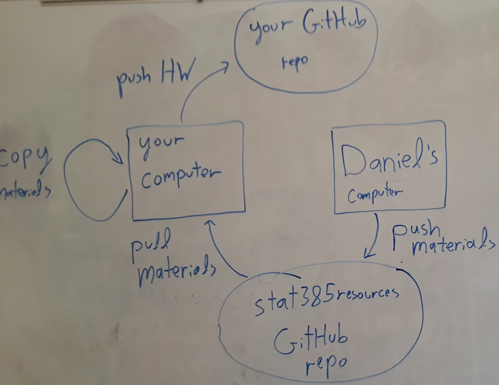

This document is meant to supplement the materials covered in week 1. It will also provide some additional detail on R markdown. Contents:

 - Accessing Homework and assignment submission workflow.
 
 - GitHub and more advanced GitHub
 
 - R markdown code chunks
 
 - Terminal commands


## Accessing Lab Assignments (review)

To access lab assignments you will:  

1. Pull changes from the remote **stat528resources** repo.

2. Create a lab directory within your local GitHub repo.

3. Create a lab# subdirectory (# corresponds to the assignment number) within the lab directory that you created in the previous step.

4. Copy your lab assignment from the **stat528resources** repo to the lab# directory that you created in the previous step.

5. Rename your lab, work on it, etc.

6. Push your repo. 


The above steps should have pushed the lab assignment into your remote personal repository. Then you just work on your lab assignments in RStudio until you've completed it - committing/pushing your updates to your repo until the deadline for the lab is reached.

Here is an old depiction of this workflow for a previous class I taught that embraced the same workflow (I apologize that this workflow is drawn on a dirty whiteboard)



***


### Git Hub 

We will now go over GitHub in more detail. First some Git terminology. Here are some Git terms we'll want to be familiar with, some of these you have seen before:

- **local**: the repo in your current working directory.

- **remote**: a repo that is not in your current working directory (or current repo). An example of this is the version of your repo that exists online.

- **cloning**: copying an existing repo 

- **master**: the main track of your repo. The master is also considered a branch.

- **branches**: pathways of the repo. We can work on branches without affecting the master and this may be useful for experimenting with something without affecting the main project.

- **staging (or the staging area)**: a file that stores information about what's being committed. We want to stage a file after we've updated it in some way so that it can be committed

- **fetching**: downloading files from a remote that are not in your working directory

- **merging**: combines updated information into one single file and puts that on the master. Merging may be used to resolve conflicts when collaborators commit changes on the same file.

- **pulling**: a single command that does both fetching and merging

- **pushing**: finalizing and formalizing an updated file by adding the changes from your local working directory to GitHub

- **conflict**: when two separate branches have made edits to the same line in a file, or when a file has been deleted in one branch but edited in the other. Conflicts can be fixed by merging and we might fix this in GitHub.

- **log**: the list of your project's commit history

- **diff**: the set of differences between commits; observing diffs helps keep track of what has changed across two commits

- **history**: the tracking of all changes to a file

- **tag**: a special user-given nickname to a commit (not the same as the message)


Here is the workflow that you go through when you push/pull: 


## More advanced GitHub

So far we have cloned repos using terminal commands and RStudio and gone over the version workflow used in this class. We will now cover some more useful GitHub functionality that will be used throughout this class.

#### Access the commit history and view contents from the past

One of the main advantages of any version control platform like GitHub is that it gives you the ability to access work that you have done in the past. This is especially beneficial when a team member has made a mistake on a project and you want to access previous versions of the project that are mistake free. To view the commit history, type 
```
git log
```

You can see all of the commits that you have made, all of your commit messages, and all of the commit reference codes. You can access any previous commit by typing 
```
git checkout commit_reference_code
```

You should see something like the following description:
```
Note: checking out '02e618b5f4fe6fdea9f08a365d2b197ff2707705'.

You are in 'detached HEAD' state. You can look around, make experimental
changes and commit them, and you can discard any commits you make in this
state without impacting any branches by performing another checkout.

If you want to create a new branch to retain commits you create, you may
do so (now or later) by using -b with the checkout command again. Example:

  git checkout -b <new-branch-name>

HEAD is now at 02e618b fixed dumb comment; notes are smart again!; organized content
```

If you only want to explore the contents of this commit or copy files out of it then you can do so and then move the GitHub branch pointer back to master by typing
```
git checkout master
```

Type 
```
git branch
```

to view which branch the GitHub pointer is currently at. You have just gone back in time by accessing previous commits in your GitHub repo or my **stat528resources** GitHub repo. 


#### Branching and merging

We can create a new branch that we plan on using for experimental changes and move the GitHub pointer to that new branch with the command
```
git checkout -b new-branch
```

Confirm that the GitHub pointer is in the new branch
```
git branch
```

Now that we are here we can make some changes (this paragraph for example). Technically speaking, this branch is now ahead of the master branch because it contains work that is built upon what existed in the master branch. Now let's suppose that we are done making changes and want to add these changes to the master branch. We achieve this by merging the new branch with master. We first move the GitHub pointer back to master with the command
```
git checkout master
```

We now complete the merge
```
git merge new-branch
```

Note that git merge merges the specified branch into the currently active branch. So we need to be on the branch that we are merging into (see [here](https://stackabuse.com/git-merge-branch-into-master/)).

If you are satisfied with the changes and no longer need the new branch then go ahead and delete it.
```
git branch -D new-branch
```

You can see that the branch new-branch was deleted properly with another call to 
```
git branch
```

We will not cover branching in this course, but it may be important to you in the future. Our course repo is a simple file and folder organization serving the role of a course website, it is not a piece of a grand complex coding project. In the real world the master branch is for deliverable goods that may be very complex, not experimental changes that may not work. Branching allows one to develop or experiment with improvements to components of a project without effecting what exists in master. When one is finished making changes in a branch then one can merge that branch into master. This is a very desirable GitHub flow that you should experiment with if you are interested in working as a data scientist, programmer, etc. See [here](https://guides.github.com/introduction/flow/) for the basics. See [here](https://git-scm.com/book/en/v2/Git-Branching-Basic-Branching-and-Merging) for a thorough reference on branching and merging. 


## R Markdown code chunks

Here is a reference link for [basic Markdown syntax](https://www.markdownguide.org/basic-syntax/). We will now discuss R code chunks in more detail.

All of the R output in these notes are generated from code chunks of the form
````markdown
```{r chunk_name}
R code
```
````
where the brackets {} specify code chunk options. In the above, **r** indicates that the code chunk should access R and then return the output given by **R code**. Here **chunk_name** is the name given to the code chunk. Naming code chunks is helpful for debugging and internal referencing.

Some common code chunk specifications are included below:

- The **echo** argument specifies whether or not the code should be displayed. The default value is set to **echo = TRUE**, you can set **echo = FALSE** to hide R code.

- The **eval** argument specifies whether or not the code should be executed. The default value is set to **eval = TRUE**, you can set **eval = FALSE** to show R code that is not executed.

- The **message** argument specifies whether or not messages from the code should be displayed. The default value is set to **message = TRUE**, you can set **message = FALSE** to hide messages.

- The **warning** argument specifies whether or not warnings from the code should be displayed. The default value is set to **warning= TRUE**, you can set **warning = FALSE** to hide warning.


The following code chunk will hide R code and not execute it
````markdown
```{r chunk_name, echo = FALSE, eval = FALSE}
R code
```
````

Another useful R Markdown feature is caching. Caching allows one to run time-consuming R output once and then have the results stored in a directory that can be accessed automatically the next time your document is compiled (provided that you do not alter the cached code chunk). The **cache** argument in the an R Markdown code chunk allows you to cache your R code.

**Important**: caching will be very useful for you when you work with large datasets and run time consuming computations later in this course. 

- The **cache** argument specifies whether or not the code should be cached. The default value is set to **cache = FALSE**, you can set **cache = TRUE** to cache your output.

A code chunk with caching enabled looks like
````markdown
```{r chunk_name, cache = TRUE}
R code
```
````

We can also cache code that builds upon the code in another cached code chunk by specifying the **dependson** argument. Such a code chunk looks like
````markdown
```{r chunk_name2, cache = TRUE, dependson = "chunk_name"}
More R code that builds on the output in chunk_name
```
````

The benefit of enabling dependson and cache is that

- R Markdown will not rerun the code in an unaltered cached code chunk, it will pull the output of this code from a cache directory that it generates automatically.

- R Markdown will automatically rerun the R code in any cached code chunk that depends on a previous code chunk that was altered, provided that the appropriate **dependson** specifications were made.

The second point is important. Let's suppose that we have two same two code chunks before except that the second code chunk no longer enables the **dependson** argument. 
````markdown
```{r chunk_name, cache = TRUE}
R code
```
````

````markdown
```{r chunk_name2, cache = TRUE}
More R code that builds on the output in chunk_name
```
````

Suppose further that you alter the code in the first code chunk and then recompile your document. Then the second code chunk which contains R code that builds on the output from the first code chunk will not be rerun. R Markdown will load the output from the old analysis that does not reflect the changes you made to the first code chunk. **This is a problem, make sure you use dependson correctly if you use caching.** Therefore, the two code chunks should be
````markdown
```{r chunk_name, cache = TRUE}
R code
```
````

````markdown
```{r chunk_name2, cache = TRUE, dependson = "chunk_name"}
More R code that builds on the output in chunk_name
```
````

## Terminal commands

If you are using Mac/Linux, see [this webpage](https://www.techrepublic.com/article/16-terminal-commands-every-user-should-know/) for a list of important terminal commands. If you are using Windows, see [this webpage](https://www.thomas-krenn.com/en/wiki/Cmd_commands_under_Windows) for a list of important terminal commands. In this course we will primarily work with: 

  - Change Directory (**cd** in all operating systems): This command will change the directory that you’re currently working with in the Terminal in order to execute other commands on a different directory, view the contents of a different directory or open a file in a different directory. 
  ```
  cd path/to/directory/
  ```
  
  - Listing Directory (**ls** in Mac/Linux or **dir** in Windows):  Use this command after navigating into a directory using the cd command to view the contents (files and directories) inside of the current directory. Use the argument -l (ls -l) to get even more information about each of the files, including the permissions, owner and date created.
  ```
  ls path/to/directory/
  ```
  
  - Copy a file to another directory (**cp** in Mac/Linux or **copy** in Windows):  This command facilitates copying a file from one location to another, or just simply making a copy of the same file with a new name. When specifying the first argument, include the originating file that you wish to copy followed by a space and a full path, filename and extension of where you want the copy to be placed when the command is executed.
  ```
  cp "filename" "newfilename"
  ```
  or
  
  ```
  cp "path/to/directory1/filename" "path/to/directory2/newfilename"
  ```
  
  - Move a file to another directory (**mv** in Mac/Linux or **move** in Windows): When you don't want to copy a file, but instead move it, use the same format of the cp (copy) command, but instead replace cp (copy) with mv (move).
  ```
  mv "filename" "newfilename"
  ```
  or
  
  ```
  mv "path/to/directory1/filename" "path/to/directory2/newfilename"
  ```
  
  - Create a directory (**mkdir** in both operating systems): This command will allow you to create a directory (folder) right from the terminal. When you need a place to store new files, just use this command to add a new directory in the current working directory, or specify a full path to the location where you want the new directory to be placed.
  ```
  mkdir path/to/new/directory_name
  ```
  
  
  
  


