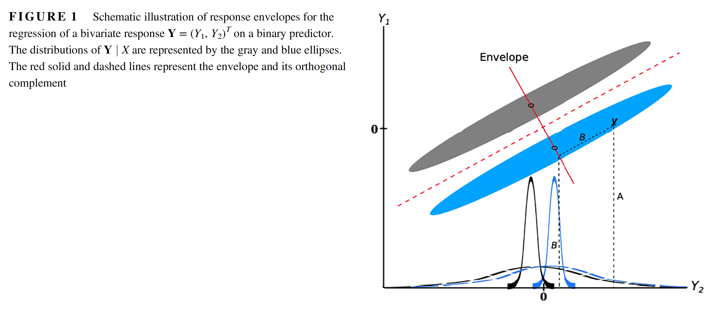

```{r setup, include=FALSE}
knitr::opts_chunk$set(echo = TRUE)
```

\allowdisplaybreaks

\newcommand{\Var}{\mathrm{Var}}
\newcommand{\Prob}{\mathbb{P}}
\newcommand{\R}{\mathbb{R}}
\newcommand{\E}{\mathrm{E}}
\newcommand{\inner}[1]{\langle #1 \rangle}
\newcommand{\indep}{\perp \!\!\! \perp}
\newcommand{\Y}{\mathbb{Y}}
\newcommand{\X}{\mathbb{X}}

\tableofcontents


# The Multivariate Regression Model and estimation

The multivariate (multiresponse) regression model is an extension of the classical linear regression model to settings involving multiple possible correlated responses. The model is of the form
\begin{equation} \label{multimodel}
  Y_i = \beta X_i + \varepsilon_i, \qquad \varepsilon_i \sim N(0,\Sigma),
\end{equation}
where $Y_i \in \R^r$ is the response vector, $X_i \in \R^p$ is a vector of predictors which we assume are fixed, $\beta \in \R^{r \times p}$ is a coefficient matrix, and $\Sigma \in \R^{r \times r}$ is a positive definite covariance matrix. This model is very similar to the classical linear regression in its construction and motivation. 

Model parameters $\beta$ and $\Sigma$ are estimated using the least squares approach and maximum likelihood estimation. Estimation of model parameters is easiest and more elegant using a multivariate representation of model \eqref{multimodel}. Let $\Y \in \R^{n \times r}$ be a matrix with rows $Y_i'$ and $\X \in \R^{n \times p}$ be a matrix with rows $X_i'$. We can then rewrite model \eqref{multimodel} as 
\begin{equation} \label{multivariate}
  \text{vec}(\Y') \sim N(\text{vec}(\beta\X'), I_n \otimes \Sigma),
\end{equation}
where $\text{vec}$ denotes the [vec operator](https://en.wikipedia.org/wiki/Vectorization_(mathematics)) that stacks the columns of a matrix, and $\otimes$ is the [Kronecker product](https://en.wikipedia.org/wiki/Kronecker_product) operator which we define with respect to matrices $A \in \R^{mn}$ and $B \in \R^{pq}$
$$
  A \otimes B = \left(\begin{array}{ccc}
  a_{11} B & \cdots & a_{1n}B \\
  \vdots & \ddots & \vdots \\
  a_{m1} B & \cdots & a_{mn}B
  \end{array}\right) \in \R^{mp \times nq}.
$$
The representation \eqref{multivariate} allows for a straightforward procedure for obtaining estimates of $\beta$. Maximizing the likelihood \eqref{multivariate} is equivalent to minimizing the sum of squares $\| \text{vec}(\Y') - \text{vec}(\beta\X')\|^2$. After a bit of algebra we arrive at an aesthetically similar ordinary least squares problem
\begin{align*}
  \| \text{vec}(\Y') - \text{vec}(\beta\X')\|^2 &= \| \text{vec}(\Y) - \text{vec}(\X\beta')\|^2 \\
    &= \| \Y - \X\beta'\|_F^2,
\end{align*}
where $\|\cdot\|_F$ is the [Frobenius norm](https://mathworld.wolfram.com/FrobeniusNorm.html) of a matrix. Continuing on, 
\begin{align*}
  \| \Y - \X\beta'\|_F^2 &= \text{tr}\left( (\Y - \X\beta')(\Y - \X\beta')' \right)  \\ 
    &= \text{tr}\left(\Y\Y'\right) - 2\text{tr}\left(\Y'\X\beta'\right) + \text{tr}\left(\beta\X'\X\beta'\right).
\end{align*}
Taking derivatives with respect to a matrix yields 
$$
  \frac{\partial \| \Y - \X\beta'\|_F^2}{\partial\beta} = -2\X'\Y + 2\X'\X\beta'.
$$
The OLS solution then takes a somewhat familiar form
$$
  \widehat{\beta} = \Y'\X\left(\X'\X\right)^{-1}.
$$
We now estimate $\Sigma$. Estimation of $\Sigma$ involves tensor algebra and tensor calculus that we will go into. First, the log likelihood of \eqref{multivariate} as a function of $\Sigma$ is written as 
\begin{equation} \label{loglike}
  l(\Sigma) \propto -\frac{1}{2}\log\left(|I_n \otimes \Sigma|\right) - \frac{1}{2}\text{vec}\left(\Y' - \beta\X'\right)'(I_n \otimes \Sigma)^{-1}\text{vec}\left(\Y' - \beta\X'\right).
\end{equation}
The term $|I_n \otimes \Sigma| = \|\Sigma\|^n$ and the term $(I_n \otimes \Sigma)^{-1} = I_n \otimes \Sigma^{-1}$ so we can rewrite the above as  
$$
  -\frac{n}{2}\log\left(|\Sigma|\right) - \frac{1}{2}\text{vec}\left(\Y' - \beta\X'\right)'(I_n \otimes \Sigma^{-1})\text{vec}\left(\Y' - \beta\X'\right).
$$
Using Kronecker product, trace, and vec operator algebra and the property $\text{vec}(AXB) = (B' \otimes A)\text{vec}(X)$ we can write 
\begin{align*}
  \text{vec}\left(\Y' - \beta\X'\right)'(I_n \otimes \Sigma^{-1})\text{vec}\left(\Y' - \beta\X'\right) &= \text{vec}\left(\Y' - \beta\X'\right)'(I_n \otimes \Sigma^{-1/2})(I_n \otimes \Sigma^{-1/2})\text{vec}\left(\Y' - \beta\X'\right) \\
  &= \text{vec}\left( \Sigma^{-1/2}(\Y' - \beta\X') \right)'\text{vec}\left( \Sigma^{-1/2}(\Y' - \beta\X') \right) \\
  &= \text{tr}\left( (\Y' - \beta\X')'\Sigma^{-1}(\Y' - \beta\X') \right) 
\end{align*}
Using matrix derivative properties \citep{lutkepohl1996handbook}, we have 
\begin{align*}
\frac{\partial\log\left(|\Sigma|\right)}{\partial\Sigma} &= \Sigma^{-1}, \\
\frac{\partial \text{tr}\left( (\Y' - \beta\X')'\Sigma^{-1}(\Y' - \beta\X') \right) }{\partial\Sigma} &= -\Sigma^{-1}(\Y' - \beta\X')(\Y' - \beta\X')'\Sigma^{-1}
\end{align*}
We use the the derivatives above to obtain the MLE for $\Sigma$,
$$
  \frac{\partial l(\Sigma)}{\partial\Sigma} = -\frac{n}{2}\Sigma^{-1} + \frac{1}{2}\Sigma^{-1}(\Y' - \beta\X')(\Y' - \beta\X')'\Sigma^{-1}.
$$
Setting the above equal to zero and solving for $\Sigma$ yields 
$$
  \Sigma = \frac{1}{n}(\Y' - \beta\X')(\Y' - \beta\X')'.
$$
Plugging in the solution for $\beta$ that was previously derived above yields our estimator
$$
  \widehat{\Sigma} = \frac{1}{n}(\Y' - \widehat{\beta}\X')(\Y' - \widehat{\beta}\X')'.
$$

## Properties of estimators

We now investigate some properties of these estimators. First of all
$$
  \E(\widehat{\beta}) = \E\left( \Y'\X\left(\X'\X\right)^{-1} \right) = \E(\Y')\X\left(\X'\X\right)^{-1} = \beta\X'\X(\X'\X)^{-1} = \beta,
$$
so that $\widehat{\beta}$ is an unbiased estimator of $\beta$. We now investigate the variance of vec$(\widehat{\beta}')$, a transformation of the matrix $\widehat{\beta}$ that allows us to represent the variance of $\widehat{\beta}$ in matrix form,
\begin{align*}
  \Var(\text{vec}(\widehat{\beta})) &= \Var(\text{vec}(\Y'\X(\X'\X)^{-1})) \\
    &= \Var([(\X'\X)^{-1}\X' \otimes I_r]\text{vec}(\Y')) \\
    &= [(\X'\X)^{-1}\X' \otimes I_r](I_n \otimes \Sigma)[\X(\X'\X)^{-1} \otimes I_r] \\
    &= (\X'\X)^{-1} \otimes \Sigma.
\end{align*}
Similarly, we have $\Var(\text{vec}(\widehat{\beta}')) = \Sigma \otimes (\X'\X)^{-1}$. These results yield 
\begin{align*}
  \text{vec}(\widehat{\beta}) &\sim N\left(\text{vec}(\beta), (\X'\X)^{-1} \otimes \Sigma\right), \\
  \text{vec}(\widehat{\beta}') &\sim N\left(\text{vec}(\beta'), \Sigma \otimes (\X'\X)^{-1}\right).
\end{align*}
As in classical regression we can perform inferences with respect elements of $\text{vec}(\beta)$ as 
$$
  \frac{\text{vec}(\widehat{\beta})_{j}}{\sqrt{((\X'\X)^{-1} \otimes \widehat{\Sigma})_{jj}}} \sim t_{n - p}
$$
where $n$ is the number of observations and $p$ is the number of predictors. We can also compute the covariance between two columns of $\widehat{\beta}$ which has the form 
$$
  \text{Cov}(\hat\beta_k,\hat\beta_l) = \sigma_{kl}(\X'\X)^{-1},
$$
and the covariance between two rows of $\widehat{\beta}$ has the form
$$
  \text{Cov}(\hat\beta_g,\hat\beta_j) = (\X'\X)^{-1}_{gj}\Sigma,
$$
where $(\X'\X)^{-1}_{gj}$ denotes the $(g,j)$-th element of $(\X'\X)^{-1}$. For the expectation of $\widehat{\Sigma}$ we re-express 
\begin{align*}
  \widehat{\Sigma} &= \frac{1}{n}(\Y' - \widehat{\beta}\X')(\Y' - \widehat{\beta}\X')' \\
    &= \frac{1}{n}(\Y' - \Y'\X(\X'\X)^{-1}\X')(\Y' - \Y'\X(\X'\X)^{-1}\X')' \\
    &= \frac{1}{n}(\Y' - \Y'\X(\X'\X)^{-1}\X')(\Y - \X(\X'\X)^{-1}\X'\Y) \\
    &= \frac{1}{n}\Y'(I_n - H)\Y
\end{align*}
where $H = \X(\X'\X)^{-1}\X'$ is an idempotent matrix and $I_n - \X(\X'\X)^{-1}\X'$ is also an idempotent matrix which is the projection into the orthogonal complement of the space spanned by the columns of $\X$, $(I_n - H)\X = 0$. With this in mind
$$
  \E(\widehat{\Sigma}) = \frac{1}{n}\E\left(\Y'(I_n - H)\Y\right) = \frac{n - p - 1}{n}\Sigma,
$$
and an unbiased estimator of $\Sigma$ is given as 
$$
  \widetilde{\Sigma} = \frac{\Y'(I_n - H)\Y}{n - p - 1}.
$$

As in classical regression we see that the expectations of the residuals satisfies
$$
  \E(\Y - \widehat{\Y}) = (I_n - H)\E(\Y) = (I_n - H)\X\beta' = 0,
$$
and we have
\begin{align*}
  \Var(\text{vec}(\Y - \widehat{\Y})') &= \Var[\text{vec}(\Y'(I_n - H))] \\
    &= \Var[ ((I_n - H) \otimes I_r)\text{vec}(\Y')] \\
    &= ((I_n - H) \otimes I_r ) \Var[\text{vec}(\Y')] ((I_n - H) \otimes I_r ) \\
    &= ((I_n - H) \otimes I_r ) (I_n \otimes \Sigma) ((I_n - H) \otimes I_r ) \\
    &= (I_n - H) \otimes \Sigma,
\end{align*}
and we could similarly write $\Var(\text{vec}(\Y - \widehat{\Y})) = \Sigma \otimes (I_n - H)$.


## Motor Trend Cars example

We first load in the dataset. The data was extracted from the 1974 Motor Trend US magazine, and comprises fuel consumption and 10 aspects of automobile design and performance for 32 automobiles (1973–74 models). The variables which we consider in this analysis are 
\begin{verbatim}
mpg:	Miles/(US) gallon
disp:	Displacement (cu.in.)
hp:	Gross horsepower
wt:	Weight (1000 lbs)
cyl:	Number of cylinders
am:	Transmission (0 = automatic, 1 = manual)
carb:	Number of carburetors
\end{verbatim}
The first four variables are response variables corresponding to engine performance and size. The next three variables are engine design variables.


```{r}
data(mtcars)
head(mtcars)
```

The standard \texttt{lm} function in R can fit multivariate linear regression models.

```{r}
mtcars$cyl = factor(mtcars$cyl)
Y = as.matrix(mtcars[,c("mpg","disp","hp","wt")])
m = lm(Y ~ cyl + am + carb, data=mtcars, x = TRUE)

# estimate of beta'
betahat = coef(m)
betahat

# estimates of Sigma
SSE = crossprod(Y - m$fitted.values)
n = nrow(Y)
p = nrow(coef(m))
SigmaMLE = SSE / n
SigmaMLE
Sigmahat = SSE / (n - p)
Sigmahat
```

We can see that the R's \texttt{vcov} function provides an estimate of $\Var(\text{vec}(\hat\beta'))$ as its default

```{r}
X = m$x
unique(round(vcov(m) - kronecker(Sigmahat, solve(crossprod(X))), 10))
```

We obtain inferences for regression coefficients corresponding to the first response variable \texttt{mpg} and compare those to what is obtained using theory.

```{r}
# summary table from lm
msum = summary(m)
msum[[1]]

# summary table from theory (they are the same)
msum2 = cbind(coef(m)[, 1], sqrt(diag( kronecker(Sigmahat, solve(crossprod(X))) ))[1:5])
msum2 = cbind(msum2, msum2[, 1] / msum2[, 2])
msum2 = cbind(msum2, sapply(msum2[, 3], function(x) pt(abs(x), df = n - p, lower = FALSE)*2 ))
msum2
```


## Inference and nested models

We can test for the presence of multiple regression coefficients simultaneously. Assume that $q < p$ and we want to test if a reduced model with $q$ terms is sufficient:
\begin{align*}
  &H_0: \beta_2 = 0_{(p-q) \times r} \\
  &H_1: \beta_2 \neq 0_{(p-q) \times r}
\end{align*}
where $\beta = (\beta_1 \; \beta_2)$. To test the above hypothesis we could use the familiar likelihood ratio test statistic:
$$
  \Lambda = \frac{\text{max}_{\beta_1,\Sigma}L(\beta_1,\Sigma)}{\text{max}_{\beta,\Sigma}L(\beta,\Sigma)}.
$$
For large $n$, we can use the modified test statistics
$$
  -\nu\log(\Lambda) \sim \chi^2_{r(p-q)}
$$
where $\nu = n - p - 1 - (1/2)(m - p + q + 1)$. There are a plethora of additional tests that we could perform in this setting (we will not stress each test's origins in this course). These include the Wilk's lambda, Pillai's trace, Hotelling-Lawley trace, and Roy's greatest root. The corresponding tests statistics follow below. First, let $E = n\tilde{\Sigma}$ where $\tilde{\Sigma}$ is the MLE for the full model with $\beta$ unconstrained and let $\tilde{H} = n(\tilde{\Sigma}_1 - \tilde{\Sigma})$ where $\tilde{\Sigma}_1$ is the MLE of $\Sigma$ in the reduced model constrained by $\beta_2 = 0$. The test statistics now follow:
\begin{itemize}
\item Wilk's lambda = $\prod_{i=1}^s \frac{1}{1+\eta_i} = \frac{|\tilde{E}|}{|\tilde{E} + \tilde{H}|}$
\item Pillai's trace = $\sum_{i=1}^s \frac{\eta_i}{1 + \eta_i} = \text{tr}[\tilde{H}(\tilde{E} + \tilde{H})^{-1}]$
\item Hotelling-Lawley trace = $\sum_{i=1}^s\eta_i = \text{tr}(\tilde{H}\tilde{E}^{-1})$
\item Roy's greatest root = $\frac{\eta_1}{1 + \eta_1}$
\end{itemize}
where $\eta_1 \geq \eta_2 \geq \cdots \geq \eta_s$ denote the nonzero eigenvalues of $\tilde{H}\tilde{E}^{-1}$. Let's demonstrate this on the motor trends cars example: 

```{r}
## anova implements these methods
m0 = lm(Y ~ am + carb, data=mtcars)
anova(m0, m, test="Wilks")
anova(m0, m, test="Pillai")

Etilde = n * SigmaMLE
SigmaTilde1 = crossprod(Y - m0$fitted.values) / n
Htilde = n * (SigmaTilde1 - SigmaMLE)
HEi = Htilde %*% solve(Etilde)
HEi.values = eigen(HEi)$values
c(Wilks = prod(1 / (1 + HEi.values)), Pillai = sum(HEi.values / (1 + HEi.values)))
```


## Interval estimation

Suppose we want to estimate $\hat{E}(Y|X=x_h)$ and the variability about $\hat{E}(Y|X=x_h)$. Given predictor value $x_h$, we have $\hat{E}(Y|X=x_h) = \hat{\beta}x_h$. Note that $\hat{Y}_h \sim N(\beta x_h, x_h'(\X'\X)^{-1}x_h\Sigma )$. We can test 
\begin{align*}
  &H_0: E(Y_h|X=x_h) = Y_h^* \\
  &H_1: E(Y_h|X=x_h) \neq Y_h^*
\end{align*}
We have
$$
  T^2 = \left(\frac{\hat{\beta}x_h - \beta x_h}{\sqrt{x_h'(\X'\X)x_h}}\right)'\widehat{\Sigma}^{-1}\left(\frac{\hat{\beta}x_h - \beta x_h}{\sqrt{x_h'(\X'\X)x_h}}\right) \sim \frac{r(n - p - 1)}{n - p - r}F_{r,(n-p-r)}.
$$
Then a $100(1-\alpha)\%$ confidence interval for component $k$ of $\E(Y_{hk}|X=x_h)$ is 
$$
  \hat{Y}_{hk} \pm \sqrt{\frac{r(n-p-1)}{n-p-r}F_{r,(n-p-r)}(\alpha)}\sqrt{x_h'(\X'\X)^{-1}x_h \hat{\sigma}_{kk}}
$$

Now suppose that we want to estimate an observed value of the response for a given predictor, here we want estimates and inferences for $\widehat{Y}_h$ at $x_h$ instead of $\hat{E}(\widehat{Y}_h|X=x_h)$. Given $x_h$, the fitted value $\widehat{Y}_h =\widehat{\beta}x_h$ remains the proper point estimator. We can test 
\begin{align*}
  &H_0: E(Y_h|X=x_h) = Y_h^* \\
  &H_1: E(Y_h|X=x_h) \neq Y_h^*
\end{align*}
We have
$$
  T^2 = \left(\frac{\hat{\beta}x_h - \beta x_h}{\sqrt{1 + x_h'(\X'\X)x_h}}\right)'\widehat{\Sigma}^{-1}\left(\frac{\hat{\beta}x_h - \beta x_h}{\sqrt{1 + x_h'(\X'\X)x_h}}\right) \sim \frac{r(n - p - 1)}{n - p - r}F_{r,(n-p-r)}.
$$
Then a $100(1-\alpha)\%$ confidence interval for component $k$ of $Y_{hk}$ is 
$$
  \hat{Y}_{hk} \pm \sqrt{\frac{r(n-p-1)}{n-p-r}F_{r,(n-p-r)}(\alpha)}\sqrt{1 + x_h'(\X'\X)^{-1}x_h \hat{\sigma}_{kk}}
$$

We will now demonstrate confidence and prediction intervals in the motor trends cars example. Note that we have to code our own functions because R does not have the capability to provide these quantities. R does provide point predictions.

```{r}
# confidence interval
newdata = data.frame(cyl=factor(6, levels=c(4,6,8)), am=1, carb=4)
predict(m, newdata, interval="confidence")

# prediction interval
newdata = data.frame(cyl=factor(6, levels=c(4,6,8)), am=1, carb=4)
predict(m, newdata, interval="prediction")
```

Here is the function which produces confidence and prediction intervals (credit to Nathaniel Helwig)


```{r}
pred.mlm = function(object, newdata, level=0.95,
                     interval = c("confidence", "prediction")){
  form = as.formula(paste("~",as.character(formula(object))[3]))
  xnew = model.matrix(form, newdata)
  fit = predict(object, newdata)
  Y = model.frame(object)[,1]
  X = model.matrix(object)
  n = nrow(Y)
  r = ncol(Y)
  p = ncol(X) - 1
  sigmas = colSums((Y - object$fitted.values)^2) / (n - p - 1)
  fit.var = diag(xnew %*% tcrossprod(solve(crossprod(X)), xnew))
  if(interval[1]=="prediction") fit.var = fit.var + 1
  const = qf(level, df1=r, df2=n-p-r) * r * (n - p - 1) / (n - p - r)
  vmat = (n/(n-p-1)) * outer(fit.var, sigmas)
  lwr = fit - sqrt(const) * sqrt(vmat)
  upr = fit + sqrt(const) * sqrt(vmat)
  if(nrow(xnew)==1L){
    ci = rbind(fit, lwr, upr)
    rownames(ci) = c("fit", "lwr", "upr")
  } else {
    ci = array(0, dim=c(nrow(xnew), r, 3))
    dimnames(ci) = list(1:nrow(xnew), colnames(Y), c("fit", "lwr", "upr") )
    ci[,,1] = fit
    ci[,,2] = lwr
    ci[,,3] = upr
  }
  ci
}
```


```{r}
# confidence interval
newdata = data.frame(cyl=factor(6, levels=c(4,6,8)), am=1, carb=4)
pred.mlm(m, newdata)

# prediction interval
newdata = data.frame(cyl=factor(6, levels=c(4,6,8)), am=1, carb=4)
pred.mlm(m, newdata, interval="prediction")
```


# The Envelope Model

Envelope methodology \citep{cook2018introduction} is a class of multivariate statistical techniques which aim to reduce variation in estimation without altering estimation objectives. Envelope methodology has its origins in providing variance reductions for the estimation of $\beta$ in the multivariate linear regression model \citep{cook2010envelope}. Before we begin, we are going to reparameterize the multivariate linear regression model \eqref{multimodel} in a form more conducive for envelope methodology. Let $\alpha$ be the intercept vector so that $\tilde{\beta}[1,X] = \alpha + \beta X$ where $\tilde{\beta}$ is $\beta$ in model \eqref{multimodel}. Then the multivariate linear model can be written as 
\begin{equation} \label{multimodel2}
  Y = \alpha + \beta X + \varepsilon,
\end{equation}
where $\beta \in \R^{r \times p}$ and $X \in \R^p$. The terms $\alpha$ and $\beta$ in model \eqref{multimodel2} would be combined to form $\beta$ in model \eqref{multimodel}. Similarly, $X$ in model \eqref{multimodel2} would be $[1, X]$ in model \eqref{multimodel}.


We first provide envelope heuristics before we jump into the formal details. The following picture is taken from \cite{cook2020envelope}:




The motivation for response envelopes in multivariate linear regression comes from allowing for the possibility that there are linear combinations of the response vector whose distribution is invariant to changes in the fixed predictor vector. Such linear combinations are referred to as $X$-invariants. If $X$-invariants exist, then allowing for them in model (\ref{multimodel2}) can result in substantial reduction in estimated variance. The linear transformation $G^TY$, where $G \in \R^{r\times q}$ with $q \leq r$, is $X$-invariant if and only if $A^TG^TY$ is $X$-invariant for any fixed full-rank matrix $A \in \R^{q\times q}$. Thus, a particular $G$ is not identifiable, but span$(G)$ is identifiable. This leads us to consider subspaces rather than specific coordinates. 

The envelope model arises by parameterizing the multivariate linear regression model (\ref{multimodel2}) in terms of the smallest subspace $\mathcal{E} \subseteq \R^r$ with the property that, for all relevant $x_1$ and $x_2$, 
$$
  (i) \;Q_{\mathcal{E}}Y | (X = x_1) \sim Q_{\mathcal{E}}Y | (X = x_2) \qquad \text{and} \qquad (ii) \; P_{\mathcal{E}}Y \indep Q_{\mathcal{E}}Y | X,
$$
where $P_{\mathcal{E}}$ is the projection into $\mathcal{E}$ and $Q_{\mathcal{E}} = I_r - P_{\mathcal{E}}$. These conditions have the following meaning: 
\begin{itemize}
\item Condition $(i)$ stipulates that the marginal distribution of $Q_{\mathcal{E}}Y$ must be unaffected by changes in $X$. It holds if and only if span$(\beta) \subseteq \mathcal{E}$, because then 
$$
  Q_{\mathcal{E}}Y = Q_{\mathcal{E}}\alpha + Q_{\mathcal{E}}\beta X + Q_{\mathcal{E}}\mathcal{E} = Q_{\mathcal{E}}\alpha + Q_{\mathcal{E}}\mathcal{E}.
$$
\item Condition $(ii)$ requires that $Q_{\mathcal{E}}Y$ be unaffected by changes in $X$ through an association with $P_{\mathcal{E}}Y$. This condition holds if and only if 
$$
  \text{cov}(P_{\mathcal{E}}Y,Q_{\mathcal{E}}Y | X) = P_{\mathcal{E}}\Sigma Q_{\mathcal{E}} = 0.
$$
\end{itemize}
Taken together, conditions $(i)$ and $(ii)$ imply that any dependence of $Y$ on $X$ must be concentrated in $P_{\mathcal{E}}Y$, the $X$-variant part of $Y$ that is material to the regression. The $X$-invariant part of $Y$, $Q_{\mathcal{E}}Y$, represents variation in the response variable that is immaterial. The next two definitions formalize the construction of an envelope in general: \vspace*{0.5cm}


\textbf{Definition 1}: A subspace $\mathcal{R} \subseteq \R^r$ is said to be a reducing subspace of a symmetric matrix $M \in \R^{r\times r}$ if $\mathcal{R}$ decomposes $M$ as $M = P_{\mathcal{R}}MP_{\mathcal{R}} + Q_{\mathcal{R}}MQ_{\mathcal{R}}$. If $\mathcal{R}$ is a reducing subspace of $M$, we say $\mathcal{R}$ reduces $M$. \vspace*{0.5cm}

\textbf{Definition 2}: Let $\mathcal{B} = \text{span}(\beta)$ and let $M \in \R^{r\times r}$ be a symmetric matrix and suppose $\mathcal{B} \subseteq \text{span}(M)$. Then the $M$-envelope of $\mathcal{B}$, denoted by $\mathcal{E}_M(\mathcal{B})$, is the intersection of all reducing subspaces of $M$ that contain $\mathcal{B}$. \vspace*{0.5cm}


Returning to model (\ref{multimodel2}), let $\mathcal{B} = \text{span}(\beta)$. The projection $P_{\mathcal{E}}$ is then the projection into $\mathcal{E}_{\Sigma}(\mathcal{B})$. We can then parameterize the envelope structure into model (\ref{multimodel2}). Let $u = \text{dim}(\mathcal{E}_{\Sigma}(\mathcal{B}))$ and let $(\Gamma, \Gamma_0) \in \R^{r\times r}$ be an orthogonal matrix with $\Gamma \in \R^{r\times u}$ and span$(\Gamma) = \mathcal{E}_{\Sigma}(\mathcal{B})$. Then the envelope model can be written as
\begin{equation} \label{envmodel}
  Y = \alpha + \Gamma\eta X + \varepsilon, \qquad \text{with} \qquad \Sigma = \Gamma\Omega\Gamma^T + \Gamma_0\Omega_0\Gamma_0^T,
\end{equation}
where: 
\begin{itemize}
\item The coefficient vector $\beta = \Gamma\eta$, where $\eta \in \R^{u\times p}$ carries the coordinates of $\beta$ relative to the basis matrix $\Gamma$.
\item The matrices $\Omega \in \R^{r\times r}$ and $\Omega_0 \in \R^{(r-u) \times (r-u)}$ are positive definite representing, respectively, material and immaterial variation.
\end{itemize}
To see how this model reflects the $X$-invariant part of $Y$, consider $\Gamma_0^TY$, 
\begin{align*}
  &\Gamma_0^TY = \Gamma_0^T\left(\alpha + \Gamma\eta X + \varepsilon\right) \\
    &\qquad= \Gamma_0^T\alpha + \Gamma_0^T\varepsilon, 
\end{align*}
where $\text{Var}(\Gamma_0^T\varepsilon) = \Omega_0$. In the above, we see that the marginal distribution of $\Gamma_0^TY$ does not contain $X$, so condition $(i)$ is satisfied. Furthermore,
\begin{align*}
  &\text{cov}(\Gamma^TY, \Gamma_0^TY|X) = \Gamma^T\Sigma\Gamma_0 \\
    &\qquad= \Gamma^T\left(\Gamma\Omega\Gamma^T + \Gamma_0\Omega_0\Gamma_0^T\right)\Gamma_0 \\
    &\qquad= 0.
\end{align*}
Thus condition $(ii)$ is also satisfied.

\textbf{Note}: The envelope model decomposes variation $\Sigma$ into a material portion $\Gamma\Omega\Gamma^T$ and an immaterial portion $\Gamma_0\Omega_0\Gamma_0^T$. The material part represents the variability in $Y$ necessary for estimation of $\beta = \Gamma\eta$. When the errors in model (\ref{envmodel}) are normally distributed then $\beta X = \Gamma\eta X$ is the mean of a normal distribution (centered predictors and responses) and the envelope model yields variance reduction by exploiting a connection between the mean and the variance. This is conflicts from lessons learned from Basu's Theorem which tells us that estimation of the mean and variance  are independent in some normal models.


## Example: wheat protein 

This data contains measurements on protein content and the logarithms of near-infrared reflectance at six wavelengths across the range 1680-2310 nm measured on each of $n = 50$ samples of ground wheat. We will consider an analysis of the first two responses $(Y_1,Y_2)$ and convert the continuous measure of protein content into a categorical variable indicating low and high levels of protein. Here, the mean difference, $\mu_2 - \mu_1$ corresponds to $\beta$ in model (\ref{multimodel2}) where $X = 0$ indicates a high level of protein and $X = 1$ indicates a low level of protein. This dataset is in the \texttt{Renvlp} package.


First, let's plot the data with the means of both responses at each protein level plotted.


```{r, message=FALSE, warning=FALSE}
library(Renvlp)
library(tidyverse)
library(ggplot2)
library(reshape2)
data(wheatprotein)

dat = data.frame(Y1 = wheatprotein[, 1] - mean( wheatprotein[, 1]), 
                  Y2 = wheatprotein[, 2] - mean( wheatprotein[, 2]),
                  X  = wheatprotein[, 8])
dat$X = as.factor(dat$X)
foo = unlist(lapply(split(dat, f = dat$X), function(xx) colMeans(xx[, 1:2])))
dat_means = data.frame(Y1 = foo[c(1,3)], Y2 = foo[c(2,4)])
ggplot(dat) + aes(x = Y1, y = Y2, color = X) + 
  geom_point() + 
  theme_minimal() + 
  geom_point(data=dat_means,  mapping=aes(x = Y1, y = Y2), col="black") + 
  stat_ellipse(geom = "polygon", aes(fill = X), alpha = 0.20)
```


We will now consider an envelope model with $\hat{u} = 1$. Model selection criteria support such a choice. 


```{r}
# which dimension?
u.env(X = as.numeric(dat$X), Y = dat[, 1:2])
```


The ratios of the standard multivariate linear regression asymptotic standard errors over those of the envelope estimator are displayed below (for each element in $\beta$). THe envelope model yields substantial variance reduction.


```{r}
# ratios at u = 1
env_mod = env(X = as.numeric(dat$X), Y = dat[, 1:2], u = 1)
env_mod$ratio
```


We depict the envelope subspace added to the previous plot that only displayed the distribution of responses. We can see how the envelope model works by thinking through this visualization. The separate marginal distributions of the response have considerable overlap. Projecting into the envelope subspace reveals a separation across the categories of $X$.

```{r}
dat_means2 = data.frame(Y1 = c(env_mod$mu[1] + 4*env_mod$beta[1],
    env_mod$mu[1] - 1.5*env_mod$beta[1]), 
  Y2 = c(env_mod$mu[2] + 4*env_mod$beta[2], 
    env_mod$mu[2] - 1.5*env_mod$beta[2]))
ggplot(dat) + aes(x = Y1, y = Y2, color = X) + 
  geom_point() + 
  theme_minimal() + 
  geom_line(data=dat_means2, mapping=aes(x = Y1, y = Y2), col="black") + 
  stat_ellipse(geom = "polygon", aes(fill = X), alpha = 0.20)
```


## Maximum likelihood estimation

In this section we discuss MLEs of the parameters in an envelope model assuming centered predictors when the dimension $u = \text{dim}(\mathcal{E}_{\Sigma}(\mathcal{B}))$ is known. The log likelihood $l_u(\alpha,\eta,\mathcal{E}_{\Sigma}(\mathcal{B}),\Omega,\Omega_0)$ with known $u$ can be expressed as 
\begin{align*}
  &l_u = -\frac{nr}{2}\log(2\pi) - \frac{n}{2}\log|\Gamma\Omega\Gamma^T + \Gamma_0\Omega_0\Gamma_0^T| \\
  &\qquad - \frac{1}{2}\sum_{i=1}^n (Y_i - \alpha - \Gamma\eta X_i)^T(\Gamma\Omega\Gamma^T + \Gamma_0\Omega_0\Gamma_0^T)^{-1}(Y_i - \alpha - \Gamma\eta X_i).
\end{align*}
From Corollary A.1 in \cite{cook2018introduction} we have that 
\begin{align*}
  \log|\Gamma\Omega\Gamma^T + \Gamma_0\Omega_0\Gamma_0^T| = \log|\Omega| + \log|\Omega_0|, \qquad \text{and} \qquad
  (\Gamma\Omega\Gamma^T + \Gamma_0\Omega_0\Gamma_0^T)^{-1} = \Gamma\Omega^{-1}\Gamma^T + \Gamma_0\Omega_0^{-1}\Gamma_0^T.
\end{align*}
Thus, 
\begin{align*}
  &l_u = -\frac{nr}{2}\log(2\pi) - \frac{n}{2}\log|\Omega| - \frac{n}{2}\log|\Omega_0| \\
  &\qquad - \frac{1}{2}\sum_{i=1}^n (Y_i - \alpha - \Gamma\eta X_i)^T(\Gamma\Omega^{-1}\Gamma^T + \Gamma_0\Omega_0^{-1}\Gamma_0^T)(Y_i - \alpha - \Gamma\eta X_i).
\end{align*}
The MLE of $\alpha$ is $\hat{\alpha} = \bar{Y}$. Substituting $\hat{\alpha}$ for $\alpha$ and decomposing $Y_i - \bar{Y} = P_\Gamma(Y_i - \bar{Y}) + Q_{\Gamma}(Y_i - \bar{Y})$ and simplifying we arrive at the first partially maximized log likelihood,
$$
  l_u^{(1)}(\eta,\mathcal{E}_{\Sigma}(\mathcal{B}),\Omega,\Omega_0) = -\frac{nr}{2}\log(2\pi) + l_u^{(11)}(\eta,\mathcal{E}_{\Sigma}(\mathcal{B}),\Omega) + l_u^{(12)}(\mathcal{E}_{\Sigma}(\mathcal{B}),\Omega_0)
$$
where 
\begin{align*}
  l_u^{(11)} &= -\frac{n}{2}\log|\Omega| - \frac{1}{2}\sum_{i=1}^n[\Gamma^T(Y_i - \bar{Y}) - \eta X_i]^T\Omega^{-1}[\Gamma^T(Y_i - \bar{Y}) - \eta X_i], \\
  l_u^{(12)} &= -\frac{n}{2}\log|\Omega_0| - \frac{1}{2}\sum_{i=1}^n(Y_i - \bar{Y})^T\Gamma_0\Omega_0^{-1}\Gamma_0^T(Y_i - \bar{Y}).
\end{align*}
Holding $\Gamma$ fixed, $l_u^{(11)}$ can be seen as the log likelihood for the multivariate regression of $\Gamma^T(Y_i - \bar{Y})$ on $X_i$ and thus $l_u^{(11)}$ is maximized over $\eta$ at $\eta = \Gamma^T\hat{\beta}_{\text{OLS}}$ (with respect to centered responses). Substituting this into $l_u^{(11)}$ we obtained the second partially maximized log likelihood,
$$
  l_u^{(21)}(\mathcal{E}_{\Sigma}(\mathcal{B}),\Omega) = -\frac{n}{2}\log|\Omega| - \frac{1}{2}\sum_{i=1}^n(\Gamma^T r_i)^T\Omega^{-1}\Gamma^T r_i,
$$
where $r_i$ is the $i$th residual vector corresponding to the standard model (\ref{multimodel2}).

Now, with $\Gamma$ fixed, $l_u^{(21)}$ is maximized over $\Omega$ at $\Omega = \Gamma^TS_{Y|X}\Gamma$ where $S_{Y|X} = \frac{1}{n}\sum_{i=1}^n r_ir_i^T = \frac{1}{n} \mathbb{Y}^TQ_{\mathbb{X}}\mathbb{Y}$, and $Q_{\mathbb{X}}$ is the projection into the orthogonal complement of the space spanned by the covariates. Consequently, we arrive at the third partially maximized log-likelihood,
$$
  l_u^{(31)}(\mathcal{E}_{\Sigma}(\mathcal{B})) = -\frac{n}{2}\log|\Gamma^TS_{Y|X}\Gamma| - \frac{nu}{2}.
$$

By similar reasoning, the value of $\Omega_0$ that maximizes $l_u^{(22)}(\mathcal{E}_{\Sigma}(\mathcal{B}),\Omega_0)$ over $\Omega_0$ is $\Omega_0 = \Gamma_0^TS_Y\Gamma_0$ where $S_Y = \frac{1}{n}\mathbb{Y}^T\mathbb{Y}$. This leads to 
$$
  l_u^{(32)}(\mathcal{E}_{\Sigma}(\mathcal{B})) = -\frac{n}{2}\log|\Gamma_0^TS_{Y}\Gamma_0| - \frac{n(r-u)}{2}.
$$

Combining the above steps, we arrive at the partially maximized log likelihood
$$
   l_u^{(3)}(\mathcal{E}_{\Sigma}(\mathcal{B})) \propto -\frac{n}{2}\log|\Gamma^T S_{Y|X}\Gamma| - \frac{n}{2}\log|\Gamma_0^T S_{Y}\Gamma_0|.
$$
Lemma A.13 in \cite{cook2018introduction} states that $\log|\Gamma_0^TS_Y\Gamma_0| = \log|S_Y| + \log|\Gamma^TS_Y^{-1}\Gamma|$ which means that the above can be written as a function of $\Gamma$ alone. We now have 
$$
   l_u^{(3)}(\mathcal{E}_{\Sigma}(\mathcal{B})) \propto -\frac{n}{2}\log|\Gamma^T S_{Y|X}\Gamma| - \frac{n}{2}\log|\Gamma^T S_{Y}^{-1}\Gamma|.
$$
The MLEs are now all functions of $\Gamma$, and we obtain these MLEs as
\begin{align*}
  \hat{\mathcal{E}}_{\Sigma}(\mathcal{B}) &= \text{span}\{\text{argmin}_G(\log|G^TS_{Y|X}G| + \log|G^TS_Y^{-1}G|)\}, \\
  \hat{\eta} &= \widehat{\Gamma}^T\hat{\beta}_{\text{OLS}}, \\
  \hat{\beta}_{\text{env}} &= \widehat{\Gamma}\hat{\eta} = \widehat{\Gamma}\widehat{\Gamma}^T\hat{\beta}_{\text{OLS}} = P_{\hat{\mathcal{E}}_{\Sigma}(\mathcal{B})}\hat{\beta}_{\text{OLS}}, \\
  \widehat{\Omega} &= \widehat{\Gamma}^T S_{Y|X} \widehat{\Gamma}, \\
  \widehat{\Omega}_0 &= \widehat{\Gamma}_0^T S_{Y} \widehat{\Gamma}_0, \\
  \widehat{\Sigma} &= \widehat{\Gamma}\widehat{\Omega}\widehat{\Gamma}^T + \widehat{\Gamma}_0\widehat{\Omega}_0\widehat{\Gamma}_0^T,
\end{align*}
where $\text{min}_G$ is over all semi-orthogonal matrices $G \in \R^{r \times u}$, and $\widehat{\Gamma}$ is any semi-orthogonal basis matrix for $\hat{\mathcal{E}}_{\Sigma}(\mathcal{B})$. Details for computing $\widehat{\Gamma}$ are beyond the scope of this course.


## Weighted envelope estimation

Estimation for all of the above quantities is conducted via the \texttt{env} function in the \texttt{Renvlp} package which we saw earlier with the wheat protein data. We also plugged in an estimated $\hat{u}$ when fitting the envelope model using \texttt{env}. The \texttt{u.env} function showed that model selection criteria such as AIC and BIC and a LRT at the $\alpha = 0.05$ testing level supported the choice $\hat{u} = 1$. All of these model comparisons are based on maximizing the likelihood, details of which are presented above. 

Note that further inferences are conditional on $\hat{u} = 1$. Also note that the LRT is nonstandard in the envelope context. Envelope models fit at different $u$ values are not necessarily nested, but an envelope model is always nested within the original model $(u=r)$. Also note the critical role of estimating $u$. Overestimation of the correct dimension implies that extraneous variation will be included. However, underestimation of the correct dimension implies that estimation will be inconsistent and is perhaps the more serious error. We can use model averaging across bootstrap samples to estimate envelope estimation variability where such a procedure accounts for the variability in the estimated envelope dimension. Consider the weighted envelope estimator
$$
  \hat{\beta}_w = \sum_{u=1}^r w_u \hat{\beta}_u,
$$
where weights are computed as 
$$
  w_u = \frac{\exp(-b_u)}{\sum_{k=1}^r \exp(-b_k)},
$$
and $b_k$ is the BIC criterion evaluated at the envelope estimator $\hat{\beta}_k$. See \cite{eck2017weighted} for more details.


## Example: wheat protein (again)

We can use the \texttt{weighted.env} function to estimation the variability of the weighted envelope estimator in the wheat protein example. We see that accounting for model selection variability drastically lowers the efficiency gains produced by an analysis that conditions on $\hat{u} = 1$, but meaningful variance reduction is still observed.


```{r boot, cache = TRUE}
set.seed(13)
wtenv = weighted.env(X = as.numeric(dat$X), Y = dat[, 1:2], bstrpNum = 1e3)

## ratios wrt to weighted envelope estimator after bootstrapping
wtenv$ratios

## ratios conditional on u = 1
env_mod$ratio

## number of times each dimension is selected
wtenv$bic_select
```


# Acknowledgments

\noindent These notes borrow materials from Nathaniel E. Helwig's Multivariate Linear Regression [notes](http://users.stat.umn.edu/~helwig/notes/mvlr-Notes.pdf) and \cite{cook2018introduction}.


\bibliographystyle{plainnat}
\bibliography{../note_sources}


