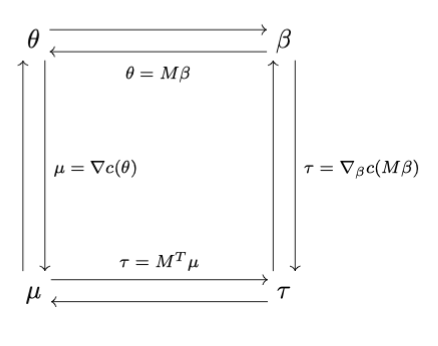

```{r setup, include=FALSE}
knitr::opts_chunk$set(echo = TRUE)
```

\allowdisplaybreaks

<!-- \textwidth=31.9pc -->
<!-- \textheight=46.5pc -->
<!-- \oddsidemargin=1pc -->
<!-- \evensidemargin=1pc -->
<!-- \headsep=15pt -->
<!-- \topmargin=.6cm -->
<!-- \leftmargin=0.5cm -->
<!-- \rightmargin=0.5cm -->
<!-- \parindent=1.7pc -->
<!-- \parskip=0pt -->

<!-- \fontsize{12}{14pt plus.8pt minus .6pt}\selectfont -->

<!-- \setcounter{page}{1} -->
<!-- \setcounter{equation}{0} -->
<!-- \renewcommand{\baselinestretch}{1.2} -->

\newcommand{\R}{\mathbb{R}}
\newcommand{\Prob}{\mathbb{P}}
\newcommand{\Proj}{\textbf{P}}
\newcommand{\E}{\mathrm{E}}
\newcommand{\Hcal}{\mathcal{H}}
\newcommand{\rootn}{\sqrt{n}}
\newcommand{\pibf}{\bm{\pi}}
\newcommand{\logit}{\text{logit}}

\newcommand{\norm}[1]{\left\lVert#1\right\rVert}
\newcommand{\indep}{\perp\!\!\!\perp}
\newcommand{\inner}[1]{\langle #1 \rangle}
\newcommand{\set}[1]{\{\, #1 \,\}}

\newtheorem{cor}{Corollary}
\newtheorem{lem}{Lemma}
\newtheorem{thm}{Theorem}
\newtheorem{defn}{Definition}
\newtheorem{prop}{Proposition}


<!-- \DeclareMathOperator{\E}{E} -->
<!-- \DeclareMathOperator{\tr}{tr} -->
<!-- \DeclareMathOperator{\etr}{etr} -->
<!-- \DeclareMathOperator{\Var}{Var} -->
<!-- \DeclareMathOperator{\MSE}{MSE} -->
<!-- \DeclareMathOperator{\vecop}{vec} -->
<!-- \DeclareMathOperator{\vech}{vech} -->

\tableofcontents

\noindent In these notes we discuss generalized linear models (GLMs) for binary data with an emphasis on models arising from exponential family theory. Our main focus will be on logistic regression. We will also consider probit regression and propensity score estimation in causal inference.

# Background: exponential family motivation

Suppose that we have a sample of data $(y_i,x_i)$, $i = 1,\ldots, n$ where $y_i$ is a binary response variable and $x_i$ is a vector of predictors taking values in $\R^p$. Recall from the exponential family notes that the log likelihood of the exponential family is of the form
\begin{equation} \label{expolog}
	l(\theta) = \inner{y, \theta} - c(\theta),
\end{equation}
where $y$ is a vector statistic having components $y_i$ and $\theta \in \R^n$ is the canonical parameter vector. In those notes $\theta$ is unconstrained and the likelihood \eqref{expolog} corresponds to a saturated regression model, one parameter for every observation.

We motivate generalized linear models (GLMs) beginning with their formulation within the context of exponential family theory. These models were referred to as canonical linear submodels in the exponential family notes. The various parameterizations discussed in those notes arose naturally from general exponential family theory, and those parameterizations were linked to each other via explicit (or implicit) mappings which preserved maximum likelihood estimation. A canonical linear submodel of an exponential family is a submodel having parameterization
$$
  \theta = M\beta
$$
where $\theta \in \R^n$ is the canonical parameter vector corresponding to the original saturated exponential family, $\beta \in \R^p$ is the canonical parameter vector for the submodel, $M$ is the model matrix with rows $x_i^T$. The matrix $M$ is usually called the \emph{model matrix} in the terminology used by the \texttt{R} functions \texttt{lm} and \texttt{glm}. We will use this notation moving forward in these notes unless otherwise stated. The submodel log likelihood is 
\begin{equation} \label{subloglike}
\begin{split}
  l(\beta) &= \inner{M^Ty,\beta} - c(M\beta).
\end{split}
\end{equation}


Recall that we have four parameters with relationships between them presented in Figure 1: the saturated model canonical and mean value parameters $\theta$ and $\mu$ and the canonical affine submodel canonical and mean value parameters $\beta$ and $\tau = M^T\mu$. The observed equals expected property for the submodel is
\begin{equation} \label{submodelmvp}
	\hat\tau = M^T\hat\mu = M^Ty.
\end{equation}
We cannot actually solve these equations for $\hat\mu$ because $M$ the mapping $\mu \to M^T\mu$ is usually not one-to-one (the $n > p$ case where $M \in \R^{n \times p}$ and is full rank). Hence we cannot determine $\hat\theta$ and $\hat\beta$ from them either. The only way to determine the MLE is to maximize the log likelihood \eqref{subloglike} for $\beta$ to obtain $\hat\beta$ and then $\hat\theta = M\hat\beta$ and $\hat\mu = \nabla c(\hat\theta)$ and $\hat\tau = M^T\hat\mu$. 

In an exponential family GLM, the saturated model canonical parameter vector $\theta$ is ``linked'' to the saturated model mean value parameter vector through the change-of-parameter mappings $g(\theta)$. We can reparameterize $\theta = M\beta$ and write
$$
 \E_\theta(Y) = \mu = g(M\beta) 
$$
which implies that we can write
$$
  g^{-1}\left(\E_\theta(Y)\right) = M\beta.
$$
Therefore, a linear function of the canonical submodel parameter vector is linked to the mean of the exponential family through the inverse change-of-parameter mapping $g^{-1}$. This is the basis of exponential family generalized linear models with link function $g^{-1}$. 


```{r, out.width = '50%', fig.align="center", echo = FALSE, fig.cap="A depiction of the transformations necessary to change between parameterizations. Arrows going in opposite directions specify transformations and their inverses. M is a known model matrix of full column rank, a is a known offset vector, and c is the cumulant function for the exponential family model." }

```


# Logistic regression model

The exponential family motivation is important as it allows us to develop general mathematical properties for models arising from the theory. Here we will switch gears to motivating specific models from a practitioner's point-of-view. We begin with the logistic regression model. The logistic regression model is one of the most widely used and studied GLMs in practice. It is the most important model for categorical response data, being commonly used for a wide variety of applications. The logistic regression model is used for analyzing a binary response variable, $y_i \in \{0,1\}$ where a $1$ encodes a "success" and a 0 encodes a "failure." The logistic regression model allows for users to model the probability of success as a function of covariates. 

For a binary response variable $Y$ and a vector of predictors $X$, let 
$$
  p(x) = P(Y = 1|X = x).
$$  
The logistic regression model is then 
\begin{equation} \label{logit}
  p(x) = P(Y = 1|X = x) = \frac{\exp(x^T\beta)}{1 + \exp(x^T\beta)}.
\end{equation}
Equivalently, the \emph{logit} (log-odds) of the response variable has a linear relationship in the canonical submodel parameters:
$$
  \text{logit}(p(x)) = \log\left(\frac{p(x)}{1 - p(x)}\right) =  x^T\beta.
$$
In vector notation, we can express the above as 
$$
  \textbf{p} = \frac{\exp(M\beta)}{1 + \exp(M\beta)} = \frac{1}{1 + \exp(-M\beta)} \quad \text{and} \quad 
    \text{logit}(\textbf{p}) = M\beta
$$
where the above $\exp(\cdot)$ and logit$(\cdot)$ operations are understood as componentwise operations. 


To see where the logit link in the specification of $p(x)$ comes from, consider the log likelihood of the binomial distribution
\begin{align*}
  l\left(\beta\right) &\propto \sum_{i=1}^n y_i\log\left(\frac{p_i}{1-p_i}\right) + \sum_{i=1}^n\log(1-p_i) \\
    &= \sum_{i=1}^n y_i\theta_i - \sum_{i=1}^n\log(1 + e^{\theta_i}) 
\end{align*}
where 
$$
  \theta_i = \log\left(\frac{p_i}{1-p_i}\right) \qquad \text{and} \qquad p_i = \frac{e^{\theta_i}}{1 + e^{\theta_i}}.
$$
We recognize the above as $p_i = g(\theta_i)$ and $\theta_i = g^{-1}(p_i)$ where $g$ is the change-of-parameter map from canonical to mean-value parameter values for Bernoulli models.

Thus we see that the logistic regression model is the same as the canonical linear submodel of an exponential family with $\theta_i = x_i^T\beta$ which in vector notation is $\theta = M\beta$. 

\vspace*{0.5cm} 

\noindent\textbf{Takeaways}: 

* The logistic regression model is an exponential family model whose log likelihood can be written in canonical form. As such, the nice properties discussed over the last four lectures hold for this model.
* Note the differences between logistic and linear regression: the logistic regression model does not possess an additive error structure (ie signal plus noise); the change of parameters map $g$ is not the identity function; the mean-value parameter is a success probability.
* In the first point above, it is interesting to note how [John A Nelder](https://en.wikipedia.org/wiki/John\_Nelder), one of the creators of GLMs, identifies the statistics of his day as too focused on mathematical properties of error distributions instead of studying the mechanisms of signal which is of interest to scientists and technologists (See Section 2 of [this paper](https://rss.onlinelibrary.wiley.com/doi/abs/10.2307/2981525)).


## Example: CCSO data

```{r, warnings = FALSE, message = FALSE}
rm(list = ls())
library(tidyverse)
```

\vspace*{0.5cm}\noindent We will demonstrate logistic regression modeling on the [Champaign County Sheriff's Office (CCSO) data frame](https://github.com/CUHackNight/JailData). This data frame consists of $n = 67764$ observations and $30$ variables in total. We will only consider a few of these variables in these notes, and we will only consider observations with complete cases. 

We now load in the CCSO data from the [stat528materials](https://github.com/DEck13/stat528materials) package. This work-in-progress R package contains materials for our course, including documentation on the CCSO data set that will be useful for these notes and your homework. We will perform most of our data wrangling operations using functionality in the tidyverse. Note these data wrangling steps can also be performed using functionality in the data.table package or using basic R. We use the tidyverse because it provides a framework that allows one to read and write code with relative ease. Some may say that the data.table provides a more powerful set of tools for handling large data sets, but these debates are beyond the scope of this lecture. You may want to play around with both!


```{r loaddata, cache = TRUE}
#install.packages("devtools")
#devtools::install_github("DEck13/stat528materials")
library(stat528materials)
data("CCSO")

## data wrangling
CCSO_small = CCSO %>% 
  mutate(atleastone = ifelse(daysInJail > 0,1,0)) %>% 
  filter(crimeCode == "OTHER TRAFFIC OFFENSES") %>%  
  filter(race %in% c("Asian/Pacific Islander","Black","White","Hispanic")) %>% 
  filter(sex %in% c("Female","Male")) %>% 
  dplyr::select(atleastone, arrestAge, sex, race, bookingDate) %>%  
  mutate(race = fct_drop(race), sex = fct_drop(sex))
CCSO_small = CCSO_small[complete.cases(CCSO_small), ]

head(CCSO_small)
dim(CCSO_small)
```


### Fit model

\vspace*{0.5cm}\noindent In this analysis we will investigate the propensity of incarcerations lasting longer than one day for crimes encoded as "other traffic offenses". The response variable is `atleastone` where a 1 indicates an incarceration lasting longer than one day and a 0 indicates an incarceration lasting shorter than 1 day. We will also determine whether or not any demographic variables drive the propensity of incarcerations lasting longer than one day. The variables under consideration are: Age (age at arrest), Sex (Male or Female), Race (Asian/Pacific Islander, Black, Hispanic, and White). 

We can fit a basic main effects model in an instant using the glm function in R.

```{r}
m1 = glm(atleastone ~ -1 + race + sex + arrestAge, data = CCSO_small, 
          family = "binomial", x = "TRUE")
```

\vspace*{0.5cm}\noindent Now let's unpack the glm function call above. We decided that we wanted to fit an exponential family regression model with log likelihood taking the general form
$$
  l(\beta) = \inner{M^Ty, \beta} - c(M\beta),
$$
where $y$ is the vector of responses $\beta$ is the submodel canonical statistic vector corresponding to the model matrix $M$ specified by the formula in the glm function call above. The first few rows of $M$ are displayed below

```{r}
M = m1$x
head(M)
```


#### MLE

\vspace*{0.5cm}\noindent The specific log likelihood for the logistic regression model can then be written as
$$
  l(\beta) \propto \sum_{i=1}^n y_ix_i^T\beta - \log\left(1 + \exp(x_i^T\beta)\right),
$$
where the $x_i$s are the rows of the design matrix $M$ and the $y_i$s are the components of the response vector $y$ (the `atleastone` variable corresponding to incarcerations lasting longer than one day). The glm function then maximizes the above log likelihood with respect to $\beta$ using IRLS. 

The glm model object \texttt{m1} has $\hat\beta$ stored among many other useful quantities, some of which will be discussed shortly. We can view summary information for $\hat\beta$ and the fitting process using the summary function

```{r}
summary(m1)
```

\vspace*{0.5cm}\noindent The Estimate column in the above summary table is $\hat\beta$. The standard error column contains estimates of the square root of the variances of the estimated submodel canonical parameter vector $\hat\beta$. Recall from the asymptotic theory of maximum likelihood estimation that 
$$
  \sqrt{n}(\hat\beta - \beta) \overset{d}{\to} N(0, \Sigma^{-1}),
$$
where $\Sigma^{-1}$ is the inverse of the Fisher information matrix. We can extract these same standard errors using the vcov function

```{r}
sqrt(diag(vcov(m1)))
```
\vspace*{0.5cm}\noindent These values are the same as those in the Std. Error column in the above summary table

```{r}
all.equal(summary(m1)$coef[, 2], sqrt(diag(vcov(m1))))
```


# Inference in logistic regression

The CCSO example connects the exponential family that we have developed to R-based data analysis. We will now discuss inference in logistic regression models. We begin with $\beta$. Recall that $\beta$ exhibits a linear relationship when the response variable takes the form logit$(p(x))$, where $p(x)$ is the conditional probability of success at covariate value $x$. 

The logit function has another names, the log-odds ratio. Therefore, a unit increase in one predictor variables $x_j$ corresponds to an increase of $\beta_j$ (estimated by $\hat\beta_j$) in the log-odds ratio with everything else being held fixed. This interpretation is similar as that in linear regression, except it is harder. A unit increase in $x_j$ corresponds to an increase of $\beta_j$ (estimated by $\hat\beta_j$) increase in the log of the ratio of the probability of success to the probability of failure.

\vspace*{0.5cm}\noindent The odds ratio itself is hard to interpret, so in many cases simple heuristics suffice. Just like in linear regression, the following rules hold:
\begin{itemize}
\item $\beta > 0$: increasing $X$ implies that $\Prob(Y = 1|X = x)$ increases.
\item $\beta = 0$: changing $X$ implies that $\Prob(Y = 1|X = x)$ do not change.
\item $\beta < 0$: increasing $X$ implies that $\Prob(Y = 1|X = x)$ decreases.
\end{itemize}

\vspace*{0.5cm} Note that the similarities between logistic and linear regression models stop when we discuss the relationship between $\beta$ and $p(x) = \Prob(Y = 1|X = x)$. In linear regression there is no "second parameterization," the link function $g^{-1}$ is the identity function, so the slope $\nabla_xE(Y|X = x) = \beta$ in linear regression. In logistic regression, we have that
$$
  \nabla_x p(x) = \nabla_x \E(Y|X = x) = \beta p(x)(1-p(x)),
$$
where $\E(Y|X=x) = \Prob(Y=1|X=x)$. The relationship between $p(x)$ and the linear predictor $\theta(x) = x^T\beta$ is shown below 
```{r}
library(faraway)
curve(ilogit(x),-6,6, xlab=expression(theta), ylab=expression(pi))
```

The logistic curve is almost linear in its midrange. This means that for modeling responses that are all of moderate probability, logistic and linear regression will not behave very differently. The curve approaches one at its upper end and zero at its lower end but never reaches these bounds. This means that logistic regression will never predict that anything is inevitable or impossible.


\vspace*{0.5cm}\noindent Now that we have a decent idea of what the submodel canonical parameter vector $\beta$ is in a logistic regression model we can discuss statistical inference corresponding to estimates of $\beta$.

## Inference and goodness-of-fit testing

Note that some contents from this section are similar to what was covered in the exponential family theory notes, and are included here for completeness.


### Wald inference for regression coefficients

As in linear regression we can make inferences about $\beta_j$ using the Wald statistic corresponding to the hypothesis test
$$
  H_o: \beta_j = 0, \qquad H_a:\beta_j \neq 0,
$$
which is given by
$$
  \frac{\hat{\beta_j}}{\text{se}(\hat\beta_j)} \sim N(0,1),
$$
where this distributional relationship holds under the null hypothesis $\beta_j = 0$. Similarly, we can form a confidence interval
$$
  \hat\beta_j \pm z_{\alpha/2}\text{se}(\hat\beta_j)
$$
where $0 < \alpha < 1$ is some error threshold. In a similar vein, we can construct $(1 - \alpha)\times 100\%$ confidence intervals for the odds ratio (not log-odds ratio) $e^{\beta_j}$ given as 
$$
  (e^{L_j}, e^{U_j})
$$
where $L_j = \hat\beta_j - z_{\alpha/2}\text{se}(\hat\beta_j)$ and $U_j = \hat\beta_j + z_{\alpha/2}\text{se}(\hat\beta_j)$ when the Wald confidence interval is reported. 

The $(1 - \alpha)\times 100\%$ Wald confidence interval for the response variable logit$(p(x))$ at a particular $x$ follows from the Delta method. We have that logit$(p(x)) = x^T\beta$ which implies that $\nabla_{\beta}$logit$(p(x)) = x$. Therefore,
$$
  \sqrt{n}\left(\text{logit}(\hat{p}(x)) - \text{logit}(p(x))\right) \overset{d}{\to} N(0, x^T\Sigma^{-1}x).
$$
We can report the following $(1 - \alpha)\times 100\%$ Wald confidence interval for the log-odds ratio
$$
  \text{logit}(\hat{p}(x)) \pm z_{\alpha/2}\sqrt{x^T\widehat\Sigma^{-1}x}.
$$

Note that, while commonly used in practice, Wald inference can be suboptimal in certain settings. See Section 5.2.6 of \cite{agresti2013cat} for specifics.


### Deviance and likelihood ratio testing

Let $l(\mu;y)$ denote the the log-likelihood of a GLM in the mean-value parameter $\mu$. Let $l(\hat\mu;y)$ denote the MLE of the log likelihood for the model. The saturated model with $\hat\mu = y$ has the maximum achievable log likelihood $l(y;y)$. This model is not useful in practice, but it does allow for comparison to other model fits. The deviance is defined by
$$
 -2\left[l(\hat\mu;y) - l(y;y)\right].
$$
This is the likelihood-ratio for testing the null hypothesis that the model against the general alternative (ie, the saturated model). The deviance has reference distribution
$$
  -2\left[l(\hat\mu;y) - l(y;y)\right] \approx \chi^2_{\text{df}}
$$
where df = $n - p$, $n$ is the sample size, and $p$ is the number of model parameters. For large samples we can use the deviance statistic to test nested models. Denote $\mathcal{M}_o$ and $\mathcal{M}_a$, respectively, as the null model and the alternative model, and let $\hat{\mu}_o$ and $\hat{\mu}_a$, respectively, be the estimated mean-value parameter vectors under $\mathcal{M}_o$ and $\mathcal{M}_a$. Then the difference in deviances between the null model and the alternative model is,
$$
 -2\left[l(\hat\mu_o;y) - l(\hat\mu_a;y)\right] = -2\left[l(\hat\mu_o;y) - l(y;y)\right] 
   - \left\{-2\left[l(\hat\mu_a;y) - l(y;y)\right]\right\} \approx \chi^2_{\text{df}},
$$
where $\text{df} = p_a - p_o$, $p_a$ is the number of model parameters in model $\mathcal{M}_a$, and $p_o$ is the number of model parameters in model $\mathcal{M}_o$.


## Example: CCSO data (continued)

We are now equipped to understand the summary table that is returned by summary.glm.

```{r}
summary(m1)
```

\vspace*{0.5cm}\noindent We can use the deviance and degrees of freedom objects to perform the likelihood ratio test to determine whether or not the main effects model fits the data well. In this case where the intercept is suppressed, the null model forces the intercept to be zero. This is equivalent to assuming that the Bernoulli success probability is fixed at $p = 1/2$ for every subject. 

```{r}
## compare with saturated model
pchisq(m1$deviance, df = m1$df.residual, lower = FALSE)

## use Chi squared testing to directly compare submodels
# null deviance
m1$null.deviance
# deviance of model with p = 1/2
-2 * 5916 * log(1/2)

pchisq(m1$null.deviance - m1$deviance, df = m1$df.null - m1$df.residual, 
       lower = FALSE)

## use LRT testing in the anova function 
# here the null model allows for an intercept term to be present
m_null = glm(atleastone ~ 1, family = "binomial", data = CCSO_small)
anova(m_null, m1, test = "LRT")
```
\vspace*{0.5cm}\noindent We can say that the fitted model fits the data better than a null model or a saturated model at any reasonably chosen error tolerance.

Let's consider the smaller model that ignores the Sex variable. A likelihood ratio test shows that the larger model is preferable at any reasonably chosen significance level $\alpha$.


```{r}
m_small = glm(atleastone ~ -1 + race + arrestAge, family = "binomial", data = CCSO_small)

## built in likelihood ratio test using anova.glm
anova(m_small, m1, test = "LRT")

## perform the above directly
pchisq(55.709, df = 1, lower = FALSE)
```


Information criteria agree with the above.

```{r}
AIC(m_small); AIC(m1)
BIC(m_small); BIC(m1)
```


# Mean-value parameters

The canonical parameterization scale is bit awkward for interpretation, although summary tables provide some insight to which components of the submodel canonical parameter vector may be driving the data generating process (under the assumed model). R software provides functionality for estimating the mean value parameters $p(x) = \E(Y|X = x) = \Prob(Y = 1| X = x)$, associated with every individual in the study. The function used to obtain mean value parameter estimates is `predict.glm` with `type = "response"` specified


```{r}
p1 = predict(m1, type = "response", se.fit = TRUE)
```


\vspace*{0.5cm}\noindent Under the hood, we specified a model with a formula call and a data frame. A model matrix $M$ is then created and $\hat\beta$ is estimated with the initial call to `glm`. The saturated model canonical parameter is expressed as $\hat\theta = M\hat{\beta}$, and this results in estimated mean value parameters of the form $\hat\mu = \nabla c(\hat\theta)$. Recall that the submodel log likelihood can be expressed as 
\begin{align*}
  l(\beta) &\propto \sum_{i=1}^n y_ix_i^T\beta - \log\left(1 + \exp(x_i^T\beta)\right) \\
    &= \sum_{i=1}^n y_i\theta_i - \log\left(1 + \exp(\theta_i)\right) = l(\theta)
\end{align*}
where $\theta_i = x_i^T\beta$. Therefore the mean value parameters are 
\begin{align*}
  \nabla c(\theta) = \nabla \log\left(1 + \exp(\theta)\right) = \frac{e^\theta}{1 + e^\theta},
\end{align*}
which are estimated by plugging in $\hat\theta = M\hat\beta$ to the above. This is what `predict.glm` does to obtain $\hat\mu$ for a model with model matrix $M$.

```{r}
## estimates from GLM
p1.fit = as.numeric(p1$fit)

## estimates from hand
betahat = m1$coefficients
foo = as.numeric(exp(M %*% betahat) / (1 + exp(M %*% betahat)))

## the same
head(cbind(p1.fit, foo))
all.equal(p1.fit, foo)
```

\vspace*{0.5cm}\noindent Good, they are in fact equal.

\vspace*{0.5cm}\noindent Standard errors \text{se}($\hat\mu$) that are computed from `predict.glm` also follow from straighforward exponential family results. 

There are noted problems with Wald based confidence intervals for mean value parameters in logistic regression (the success probability). See [here for more details in the context of binomial sampling proportions](https://projecteuclid.org/journals/statistical-science/volume-16/issue-2/Interval-Estimation-for-a-Binomial-Proportion/10.1214/ss/1009213286.full).


## Be careful with inferences

It is important to remember that a canonical linear submodel is not unique to a particular model matrix or a particular model matrix, but is uniqely identified by the span of a model matrix. We demonstrate this point using the CCSO data. Here we create two new model matrices with same span as our original model and demonstrate that the likelihood has the same maximized value and mean-value parameter estimates are the same for all considered models.

\vspace*{12pt}

```{r}
## fit model without suppressing the intercept
m2 = glm(atleastone ~ race + sex + arrestAge, data = CCSO_small, 
          family = "binomial", x = "TRUE")
M3 = m1$x %*% eigen(vcov(m1))$vec
m3 = glm(CCSO_small$atleastone ~ -1 + M3, family = "binomial")

## coefficient estimates are different
mat = cbind(coef(m1), coef(m2), coef(m3))
mat

## maximized likelihood and estimates of mean-value parameters are 
## the same
AIC(m1); AIC(m2); AIC(m3)
all.equal(p1.fit, as.numeric(predict(m2, type = "response")))
all.equal(p1.fit, as.numeric(predict(m3, type = "response")))
```


# Profile likelihood based confidence intervals

Say that we want a confidence interval for a parameter vector $\beta$ in a model $\mathcal{M}$. Let $\mathcal{M}_o(\beta_o)$ be the same model as $\mathcal{M}$, except that $\beta$ is fixed at $\beta_o$. Then the likelihood ratio tests the hypothesis that
$$
  H_o: \beta = \beta_o \qquad H_a: \beta \neq \beta_o
$$
and this test produces a P-value (from a $\chi^2$ approximation). Then
$$
  \{\beta_o: \text{P-value} > \alpha\}
$$
is a $(1 - \alpha)\times 100\%$ confidence set (usually a confidence interval) for $\beta$. This interval is a profile likelihood confidence interval. Standard software estimates this interval.


```{r}
## profile based method
beta.profile = confint(m1)
beta.profile

## Wald based method
se = sqrt(diag(vcov(m1)))
cbind(betahat + qnorm(0.025) * sqrt(diag(vcov(m1))), 
      betahat + qnorm(0.975) * sqrt(diag(vcov(m1))))
```


# Diagnostics (will revisit)

Model diagnostics for logistic regression fits are not as prevalent as those in linear regression. 

\cite{esarey2012assessing} developed a method to assess the fit of binary-dependent variable models and compare this method to existing approaches. This method compares a model's predicted probability $\Prob(Y = 1)$  to the observed frequency of $Y=1$ in the data set. If the model is a good fit to the data, subsets of the data with $\Prob(Y = 1) \approx m$ should have about $m$ proportion of cases for which $Y = 1$. The process is analogous to plotting fitted and observed values of the dependent variable against one another, a commonly used fit diagnostic for continuous dependent variable models.  

<!-- They used a local (nonparametric) linear regression to overcome data sparseness (i.e., a paucity of cases for all possible values of $m$) and parametric bootstrapping to determine whether prediction inaccuracies are attributable to sampling variation or misspecification. This information is presented in a visually impactful heat map plot that can quickly help a researcher visualize how well a statistical model's predictions match observed frequencies in the sample, whether inaccuracies are symptomatic of misspecification or are simply noise, and whether the model fits the data over the entire range of probabilities (e.g., whether it is equally capable of fitting high- and low-probability events). We also present a heat map statistic, a holistic evaluation of the heat map plot that provides a dispositive indicator of model misspecification. -->

The difficulty is that (unlike $Y$) the true success probability $p$ is not observable. But if we collect all the observations with values of $\hat{p} \approx m$, approximately $m$ proportion of those cases should be $Y=1$ when $\hat{p}$ is a good estimate of $p$. That is, 
$$
  \Prob(Y = 1|\hat{p} = m) \approx m
$$
when our model provides good estimates of $p$. 

In brief, the approach in \cite{esarey2012assessing} is to estimate an empirical model, sort observations according to the predicted $p$ of the model, and then determine whether this predicted probability is an accurate predictor of $R(p) = \Prob(Y = 1|p)$ by plotting them against each other. In a perfectly fitting model, $p = R(p)$ for all values of $p$ and the plot is a straight 45 degree line through the origin. We will revisit details of this method when cover diagnostics in more detail.

This methodology is implemented in the \texttt{heatmapFit} package. We see that our fitted model exhibits great fit. 


```{r heatmap, cache = TRUE}
library(heatmapFit)
y = CCSO_small$atleastone
heatmap.fit(y, p1.fit)
```


We can see that the model which omits sex does not fit the data as well.


```{r heatmap2, cache = TRUE}
heatmap.fit(y, predict(m_small, type = "response"))
```


# Alternatives to the logit link

## Probit Regression

In this class we have focused on exponential theory, canonical links, and generalized linear models that arise from this perspective. We now present an alternative to this paradigm in the form of the probit link function for binary response variables. Probit regression arises from normal latent variable models. Recall that we are interested in modeling $p(x) = \Prob(Y = 1|X = x)$ in the form
$$
  g^{-1}(p(x)) = x^T\beta
$$
where $g^{-1}$ is not the logit function. In probit regression we specify $g = \Phi$ where $\Phi$ is the CDF of a standard normal distribution. Thus the probit regression model is of the form
$$
  \Phi^{-1}(p(x)) = x^T\beta.
$$
A related latent variable (referred to as a threshold model) also specifies the probit model. This model assumes that there is an unobserved continuous response $y^*$ such that the observed response $y = 0$ if $y^* \leq \tau$ and $y = 1$ if $y^* > \tau$. Suppose that $y^* = \mu + \varepsilon$, where $\mu = x^T\beta$ and where $\varepsilon_i$ are independent realizations from a $N(0,\sigma^2)$ distribution. Then,
\begin{align*}
  \Prob(Y = 1\mid X = x) &= \Prob(Y^* > \tau\mid X = x) = \Prob(x^T\beta + \varepsilon > \tau\mid X = x) \\
    &= \Prob(-\varepsilon < x^T\beta - \tau\mid X = x) = \Phi\left((x^T\beta - \tau)/\sigma\right)
\end{align*}
where it is noted that $\varepsilon \overset{d}{=} -\varepsilon$. There is no information in the data about $\sigma$ or the threshold $\tau$. An equivalent model results if we multiply $(\beta^T,\sigma,\tau)$ by any positive constant. For identifiability, we set $\sigma = 1$ and $\tau = 0$, and the probit model results. It should be noted that the same latent variable threshold model story can be told by the logistic regression model. To see this, replace the normal distribution specification for $\varepsilon$ in the above with with a [logistic distribution](https://en.wikipedia.org/wiki/Logistic_distribution) with $\mu = 0$ and $s = 1$.

\vspace*{0.5cm}\noindent Another latent variable interpretation of the probit model is based on utility functions. Consider the choice between two options, such as two brands. Let $U_0$ denote the utility of outcome $y = 0$ and let $U_1$ denote the utility of outcome $y = 1$. For $y \in \{0,1\}$, suppose that $U_y = x^T\beta_y + \varepsilon_y$. A particular subject selects $y=1$ when $U_1 > U_0$. Now suppose that $\varepsilon_0$ and $\varepsilon_1$ are independent $N(0,1)$ random variables. Then,
\begin{align*}
  \Prob(Y = 1\mid X = x) &= \Prob(x^T\beta_1 + \varepsilon_1 > x^T\beta_0 + \varepsilon_0\mid X = x) \\
    &= \Prob\left((\varepsilon_0 - \varepsilon_1)/\sqrt{2} < x^T(\beta_1 - \beta_0)/\sqrt{2}\mid X = x\right) \\
    &= \Phi(x^T\beta^*)
\end{align*}
where $\beta^* = (\beta_1 - \beta_0)/\sqrt{2}$. Again, this is the probit model. The probit model can extend to an inverse $t$ link, for which corresponding latent variable models can better accommodate outliers.

Parameters in probit models can be interpreted in terms of effects on $\E(Y^*)$ for the threshold latent variable model presented above. Since $Y^* = x^T\beta + \varepsilon$ where $\varepsilon \sim N(0,1)$ has the CDF $\Phi$, a 1-unit increase in $x$ corresonds to a $\beta$ standard deviation increase in $\E(Y^*)$. Alternatively, we can summarize effects on the probability scale, such as by comparing estimated probabilities at extreme values or quartiles of a predictor, with other predictors set at their means. Although probit model parameter estimates are on a different scale than logistic model parameter estimates, the probability summaries of effects are similar.


## Probit model fitting

Let $y_i$ be the number of successes out of $n_i$ trials at setting $x_i$, $i = 1,\ldots,n$. Let $x_{ij}$ denote the value of predictor $j$ for subject $i$. For the probit model $\Phi^{-1}(p(x_i)) = \sum_{j=1}\beta_jx_{ij}$, the log likelihood function is
$$
  l(\beta) = \log\left\{\prod_{i=1}^n\left[\Phi\left(\sum_j \beta_jx_{ij}\right)\right]^{y_i}
  \left[1 - \Phi\left(\sum_j \beta_jx_{ij}\right)\right]^{n_i - y_i}\right\}.
$$
Differentiation with respect to $\beta_j$ leads to,
$$
  \sum_{i}\left\{\left[\frac{n_i\left[y_i - \Phi\left(\sum_j\beta_j x_{ij}\right)\right]x_{ij}}
  {\Phi\left(\sum_j\beta_j x_{ij}\right)\left[1 - \Phi\left(\sum_j\beta_j x_{ij}\right)\right]}\right] \phi\left(\sum_j\beta_j x_{ij}\right)\right\} = 0,
$$
with $\phi(\cdot)$ the standard normal pdf.

When the link function is not the canonical link (which is the logit function for binary data), there is no reduction of the data in the form of Fisher's notion of sufficieny. Fisher (1935), in an appendix to Bliss (1935) for the single predictor case, showed how to solve the above equations using the Fisher scoring algorithm. He also pointed out that cases with $y_i = 0$ or $y_i = n_i$ were not problematic for ML fitting, unlike weighted least squares using sample probits (or logits). The estimated asymptotic covariance matrix of $\hat\beta$ has the form
$$
  \widehat{\text{cov}}(\hat\beta) = \left(M^T\widehat{W}M\right)^{-1}.
$$
For probit models, $\widehat{W}$ is the diagonal matrix with elements
$$
  w_i =\frac{n_i\left[\phi\left(\sum_j\hat\beta_j x_{ij}\right)\right]^2}
  {\left\{\Phi\left(\sum_j\hat\beta_j x_{ij}\right)\left[1 - \Phi\left(\hat\beta_j x_{ij}\right)\right]\right\}}.
$$
The Newton-Raphson algorithm yields the same MLE estimates but slightly different standard errors. For the information matrix inverted to obtain the asymptotic covariance matrix, Newton-Raphson uses observed information, whereas Fisher scoring uses expected information. These differ for link functions other than the canonical link.

## Probit Example

We return to our CCSO example and refit the logistic regression model with a probit link function.

```{r}
m2 = glm(atleastone ~ -1 + race + sex + arrestAge, data = CCSO_small,
          family = binomial(link = "probit"), x = "TRUE")
summary(m2)
```

```{r heatmap_probit, cache = TRUE}
heatmap.fit(y, predict(m2, type = "response"))
```


Summarise these results.


# Inverse propensity score weighting (IPW) in Causal Inference

## Brief explanation of causal inference

This example will highlight the logistic regression as a model for treatment assignment in causal inference. In this example we will only scratch the surface of casual inference and will cover important causal estimators in very little detail. External references that go into more details about causal inference will be provided. Feel free to read them if you are interested. The goal of our data analysis will be to determine if course lectures provide any improvement to student exam scores when an online course implementation already exists.

One of the central goals of causal inference is to estimate the average treatment effect (ATE). In its most simple presentation, we will assume that the treatment variable is binary. The ATE measures the difference in mean outcomes between individuals assigned to the treatment and individuals assigned to the control. However, there is a difficulty with estimation since individuals do not simultaneously receive the treatment and the control. When the study is randomized this difficulty is mitigated because randomization ensures (when $n$ is large enough) that baseline covariates which may influence the response have the same distribution in both the treatment and control groups. In observational studies this may not be so, and the researcher may have no information about the treatment assignment mechanism. In the observational setting, the collected covariates could confound the relationship between the treatment variable and the response variable.

One technique for estimating the ATE in causal studies is through [inverse propensity score weighting (IPW)](https://www.rebeccabarter.com/blog/2017-07-05-ip-weighting). The IPW technique makes use of a treatment assignment model. In the simple setting we will take a logistic regression model as our model for treatment assignment (as often done in practice). The idea of IPW is to create a pseudo population that exhibits balance in baseline covariates through the weighting of individuals corresponding to how likely they belong to either the treatment or control group given their covariate profile. Thus IPW techniques can mimic random assignment up to measured confounders.

## Define ATEs for additional in-person lectures

We will now go through an example. In this example we estimate the [causal effect of adding in-person lectures to an online version of STAT 200 at UIUC](https://journals.sagepub.com/doi/full/10.1177/00472395231166592). The response variable $Y$ is the comprehensive 3-hour Final that was Scantron graded at the end of each semester, and the treatment variable $A$ is the presence or absence of in-person lectures. The online only course is considered the treatment and the regular in-person course with recorded lectures is the control.

We estimate the causal effect of online learning (or absence of in-person lecture) by estimating the ATE using inverse propensity score weighting methods. The form of this estimator of the ATE is
$$
 \widehat{\text{ATE}} = \frac{1}{n}\sum_{i=1}^n \left(w_iA_iY_i - w_i(1-A_i)Y_i\right),
$$
where the weights $w_i$ are a functions of the propensity scores $\hat{p}_i = \widehat{P}(A_i = 1|X_i)$, $i = 1,\ldots,n$. The propensity scores are each subjects conditional probability of belonging to the treatment group given their covariate information. We will estimate the propensity scores using a logistic regression model.


The most basic inverse propensity weighted (IPW) estimator has weights $w_i$ of the form
$$
  w_i = \frac{A_i}{\hat{p}_i} + \frac{1 - A_i}{1 - \hat{p}_i}.
$$
If the propensity score were to be known apriori in the above, then $\widehat{\text{ATE}}$ is an unbiased estimator for the average treatment effect. Therefore, $p_i$ must be the true propensity score for this estimator to be consistent (ie our logistic regression model must be correctly specified).


This basic IPW estimator can be unstable, it does not create balanced pseudo populations (which one would expect under purely random assignment), and is inappropriate for continuous predictors in our analysis. We consider an [alternative stable estimator of the ATE](https://onlinelibrary.wiley.com/doi/full/10.1002/sim.6607) (referred to as $\text{ATE}_{\text{IPW}}$). The alternative stable estimator of the ATE has conventional inverse propensity score weights with changes being made to the aggregation. This estimator of the ATE is
$$
 \widehat{\text{ATE}}_{\text{alt}} =
   \left(\sum_{i=1}^n\frac{A_i}{\hat{p}_i}\right)^{-1}\sum_{i=1}^nw_iA_iY_i -
   \left(\sum_{i=1}^n\frac{1-A_i}{1-\hat{p}_i}\right)^{-1}\sum_{i=1}^nw_i(1-A_i)Y_i
$$
where $w_i$ in the above are basic IPW weights.


The estimators $\widehat{\text{ATE}}$ and $\widehat{\text{ATE}}_{\text{alt}}$ are consistent if the propensity score model is correctly specified, so should be approximately unbiased in finite samples. We will also consider a [double robust (DR) estimator](https://www.tandfonline.com/doi/abs/10.1080/01621459.1994.10476818) of the ATE. This estimator is
$$
  \widehat{\text{ATE}}_{\text{DR}} = \frac{1}{n}\sum_{i=1}^n \frac{A_iY_i - (A_i - \hat p_i)m_1(X_i,\hat{\alpha}_1)}{\hat p_i} -  \frac{1}{n}\sum_{i=1}^n \frac{(1-A_i)Y_i + (A_i - \hat p_i)m_0(X_i,\hat{\alpha}_0)}{1 - \hat p_i},
$$
where $m_a(X,\alpha_a) = E(Y|A=a,X)$ is the regression of the response on $X$ in each level of $A \in \{0,1\}$, depending on parameters $\alpha_a$, and $\hat{\alpha}_a$ is the estimator for $\alpha_a$ based on the data from subjects with $A = a$.

## Estimate ATEs

We now load in the data and provide estimates to the ATEs above.


```{r}
dat = read.csv("online.csv", header = TRUE)[, -1]
head(dat)
```

We specify the propensity score logistic regression model and obtain the estimated propensity scores (estimates of the probability of being in the treatment group).

```{r}
# basic data wrangling (will induce non problematic rank deficiency)
dat_small = dat %>% dplyr::select(Online, ACTMath, ACTMajor, ACT, Gender,
                        International, F17, S18, S19, Fa19, FR, SO, JR)

# prop score model
m = glm(Online ~., data = dat_small, family = "binomial")
trt = dat_small$Online
preds = predict(m, type = "response")
```


The propensity score model seems to align well with the observed data.
```{r heatmap_prop_model, warning = FALSE, message = FALSE, cache = TRUE}
trt = dat_small$Online
heatmap.fit(trt, preds)
```

\vspace{12pt}

The standard IPW technique suggests that the removal of an in-person course hurts grades by roughly three points. However, there are some large weights corresponding to individuals in the online-only group which lead to a lack of reliability in this estimator.

\vspace{12pt}

```{r}
weights_IPW = (trt / preds - (1-trt) / (1 -preds))
mean(weights_IPW * dat$ObjExam)
max(abs(weights_IPW))

weights_IPW[abs(weights_IPW) > 8]
```


We now obtain the weights for the stabilized estimator
$$
  \widetilde{w}_i =  \frac{\frac{A_i}{\hat{p}_i}}{\sum_{i=j}^n\frac{A_j}{\hat{p}_j}} + \frac{\frac{1-A_i}{1 -\hat{p}_i}}{\sum_{j=1}^n\frac{1-A_j}{1-\hat{p}_j}}
$$
and we check for the balance of weights in the online and in-person groups across the Gender and International variables
\vspace{12pt}

```{r}
# estimate the stabilized IPW weights
weights_alt_trt = 1 / sum(trt / preds) * trt /preds
weights_alt_notrt = 1 / sum((1 - trt)/(1 - preds)) * (1-trt)/(1-preds)
dat = data.frame(dat, weights = weights_alt_trt - weights_alt_notrt)

# check balance for gender and international (other variables are also balanced)
dat %>% group_by(Gender, Online) %>% summarise(sum(weights))
dat %>% group_by(International, Online) %>% summarise(sum(weights))
```

\vspace{12pt}
We now estimate the ATE corresponding to these weights.
\vspace{12pt}

```{r}
ATE_alt = sum(weights_alt_trt * dat$ObjExam) -
  sum(weights_alt_notrt * dat$ObjExam)
ATE_alt
```

\vspace{12pt}
We now estimate the doubly robust ATE
\vspace{12pt}

```{r}
# estimate DR version ATE
m_trt = lm(ObjExam ~ ACTMath + ACTMajor + ACT + International + Gender +
            FR + SO + JR + F17 + S18 + S19,
            data = dat[trt == 1, ])
Y_trt = predict(m_trt, newdata = dat)
m_notrt = lm(ObjExam ~ ACTMath + ACTMajor + ACT + International + Gender +
              FR + SO + JR + F17 + S18 + S19,
              data = dat[trt == 0, ])
Y_notrt = predict(m_notrt, newdata = dat)
ATE_DR = mean( (dat$ObjExam * trt - (trt - preds) * Y_trt) / preds -
  (dat$ObjExam * (1 - trt) + (trt - preds)*Y_notrt) / (1 - preds))
ATE_DR
```

The two quantities are essentially the same, both estimates of the ATE show that additional in-person instruction has no advantage over online instruction in STAT 200. Estimates of variability of these different ATEs can be found using the nonparametric (cases) bootstrap


# Appendix: nonparametric cases bootstrap

We introduce a nonparametric bootstrap procedure to estimate the uncertainty of estimates of model parameters. The idea of the bootstrap is to apply the same estimation task used in the original data set to many resamples of the observed data in order to estimate uncertainty of the modeling task. The intuition is that if the original data is large enough, then resamples from the original data mimic sampling from the data-generating process.

Suppose that we have a sample of data $(y_i,x_i)$, $i = 1,\ldots, n$ where $y_i$ is a binary response variable and $x_i$ is a vector of predictors taking values in $\R^p$. For the bootstrapping cases method to estimate uncertainty of estimates of the submodel canonical parameter vector, the procedure is as follows:

1. Sample $(y_i^*,x_i^*)$, $i = 1,\ldots, n$ with replacement from the original sample $(y_i,x_i)$, $i = 1,\ldots, n$.
2. Calculate $\hat{\beta}^*$ using the resampled data in step 1 in the same way that $\hat{\beta}$ is calculated using the original data.
3. Repeat steps 1-2 a total of $B$ times to for the bootstrap distribution of $\hat{\beta}$.

We can then estimate the uncertainty using Wald-type confidence intervals where the standard errors are calculated using the bootstrap sample of $B$ values of $\hat{\beta}^*$
$$
  \hat{\beta} \pm Z_{1 -\alpha/2} \hat{se}(\hat{\beta})
$$
where $Z_{1 -\alpha/2}$ is the $(1-\alpha/2)$th quantile of a standard normal distribution. Alternatively, we can report a percentile based confidence interval calculated using quantiles of the bootstrap distribution
$$
  [Q^*_{(\alpha/2)}, Q^*_{(1-\alpha/2)}],
$$
where $Q^*_{(\alpha/2)}$ and $Q^*_{(1-\alpha/2)}$ denote the quantiles of the bootstrap sample of $B$ values of $\hat{\beta}^*$.


The [analysis of the STAT 200 data](https://journals.sagepub.com/doi/full/10.1177/00472395231166592) used the percentile method. It should be noted that the percentile method is simple to compute, but it suffers some drawbacks. For more details, see Section 5.3 of [these course notes](http://users.stat.umn.edu/~helwig/notes/npboot-notes.html#nonparametric-bootstrap-basics). In the analysis of STAT 200 data, it appeared that the simple bootstrap percentile confidence interval above was sufficient. This interval closely matched usual Wald-type confidence intervals which assume correctness of the specified model.


# Acknowledgments

\noindent These notes borrow materials from Trevor Park's STAT 426 notes and Charles Geyer's notes on exponential families and other topics. We also borrow materials from \cite{agresti2013cat}, \cite{faraway2016extending}, and \cite{sundberg2019statistical}.


\bibliographystyle{plainnat}
\bibliography{../note_sources}


