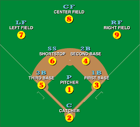

\allowdisplaybreaks

<!-- \textwidth=31.9pc -->
<!-- \textheight=46.5pc -->
<!-- \oddsidemargin=1pc -->
<!-- \evensidemargin=1pc -->
<!-- \headsep=15pt -->
<!-- \topmargin=.6cm -->
<!-- \leftmargin=0.5cm -->
<!-- \rightmargin=0.5cm -->
<!-- \parindent=1.7pc -->
<!-- \parskip=0pt -->

<!-- \fontsize{12}{14pt plus.8pt minus .6pt}\selectfont -->

<!-- \setcounter{page}{1} -->
<!-- \setcounter{equation}{0} -->
<!-- \renewcommand{\baselinestretch}{1.2} -->

\newcommand{\R}{\mathbb{R}}
\newcommand{\Prob}{\mathbb{P}}
\newcommand{\Proj}{\textbf{P}}
\newcommand{\E}{\mathrm{E}}
\newcommand{\Hcal}{\mathcal{H}}
\newcommand{\rootn}{\sqrt{n}}
\newcommand{\pibf}{\bm{\pi}}

\newcommand{\norm}[1]{\left\lVert#1\right\rVert}
\newcommand{\indep}{\perp\!\!\!\perp}
\newcommand{\inner}[1]{\langle #1 \rangle}
\newcommand{\set}[1]{\{\, #1 \,\}}

\newtheorem{cor}{Corollary}
\newtheorem{lem}{Lemma}
\newtheorem{thm}{Theorem}
\newtheorem{defn}{Definition}
\newtheorem{prop}{Proposition}

```{r setup, include=FALSE}
knitr::opts_chunk$set(echo = TRUE)
```


\tableofcontents

We now develop modeling for multinomial responses and ordinal categorical responses. These models arise as a natural extension of the generalized linear modeling framework that we have discussed throughout.

# Introduction to multinomial response models

In these notes we will suppose that the response varible $Y$ is categorical, with $J$ possible categories. The response variable can be: 
\begin{itemize}
\item nominal (for example: your favorite soft drink among Coke, Pepsi, other)
\item ordinal (for example: customer rating of service among good, neutral, or bad)
\end{itemize}
\vspace*{0.5cm}\noindent Let categories be coded as $1,...,J$ (in order, if ordinal). In these notes we will model the distribution of $Y$ conditional on $x \in \R^p$. Let 
$$
  \pi_j(x) = \Prob\left(Y \; \text{in category} \; j\mid x\right), \qquad j = 1,...,J,
$$
and note that the multinomial model has the constraint
$$
  \sum_{j=1}^J \pi_j(x) = 1, \qquad \text{for any} \; x.
$$
As usual, there are $n$ observations of $(Y,x)$. Assume that observations of $Y$ are independent (conditional on $x$). Let $x_i$ be the explanatory vector for observation $i$. The response variable $Y$ may be represented in alternative formats. We could use \textbf{ungrouped codes} where $y_i = j$, $j \in \{1,...,J\}$, but this is inconvenient for mathematical expressions. We can use \textbf{ungrouped indicator vectors}: 
$$
  y_i = (y_{i1},...,y_{iJ})
$$
where 
$$
  y_{ij} = \left\{\begin{array}{cl}
  1 & \text{if obervation} \; i \; \text{in category} \; j \\
  0 & \text{otherwise},
  \end{array}\right.
$$
where $\sum_{j=1}^J y_{ij} = 1$ for every $i$. In this ungrouped indicator vector formulation we have that
$$
  Y_i \sim \text{Multinomial}(1,\pi(x_i)),
$$
\noindent where $\pi(x) = (\pi_1(x),\ldots,\pi_J(x))$. We can also consider \textbf{grouped codes} where we assume observation $i$ represents $n_i$ independent responses having the same explanatory vector $x_i$ (i.e., replicates). Let 
$$
  y_i = (y_{i1},\ldots,y_{iJ})
$$
with $y_{ij}$ defined as the number of responses in category $j$ (for observation $i$) so that $\sum_{j=1}^J y_{ij} = n_i$. Then,
$$
  Y_i \sim \text{Multinomial}(n_i,\pi(x_i)).
$$


# Nominal responses

We will now consider the baseline-category logistic model for multinomial response data: 
$$
  \log\left(\frac{\pi_j(x)}{\pi_J(x)}\right) = x^T\beta_j, \qquad j = 1,\ldots,J-1.
$$
These are the baseline (category) logits, with $J$ as the baseline category. The $J-1$ values of vectors $\beta_j$ are unrestricted parameters to be estimated (MLE), where we define $\beta_J = 0$. Logits for other pairs of categories can also be determined. For categories $a$ and $b$ we can write 
\begin{align*}
  \log\left(\frac{\pi_a(x)}{\pi_b(x)}\right) &= \log\left(\frac{\pi_a(x)}{\pi_J(x)}\right) - \log\left(\frac{\pi_b(x)}{\pi_J(x)}\right) \\
  &= x^T\beta_a - x^T\beta_b \\
  &= x^T(\beta_a - \beta_b)
\end{align*}
Note: Any choice of baseline category leads to a model of the same form (with linearly transformed parameters).


## Interpretations 

Let $x_k$ be the $k$th component of $x$, and let $x_{-k}$ be the vector $x$ with the $k$th component removed. Also let $\beta_{jk}$ be the $k$th component of $\beta_j$ and let $\beta_{j-k}$ be the vector $\beta$ with the $k$th component removed. Then exponentiation gives 
$$
  \frac{\pi_j(x)}{\pi_J(x)} = e^{x^T\beta_j} %=  e^{\beta_{jk}x_k + x_{-k}^T\beta_{j-k}}
$$
as the odds of $Y = j$ \textbf{conditional} on $\{Y = j\; \text{or} \; Y = J\}$. We call it the odds of $j$ relative to $J$. Then,
$$
 e^{\beta_{jk}x_k}
$$
is the multiplicative change in odds when $x_k$ increases by one with all other components $x_{-k}$ held fixed. The response probabilities are given as
$$
  \pi_j(x) = \frac{e^{x^T\beta_j}}{\sum_{h=1}^J e^{x^T\beta_h}}
$$
where we recall that $\beta_J = 0$. Remark: unlike in the binomial case, $\pi_j(x)$ is not necessarily a monotone function of each component $x_k$.


## Estimation 

The log likelihood for this model is given by
\begin{align*}
  l(\theta) &\propto \log\prod_{i=1}^n\prod_{j=1}^J \pi_j(x_i;\theta)^{y_{ij}} \\
    &= \sum_{i=1}^n\left\{\sum_{j=1}^{J-1}y_{ij}(\alpha_j + x_i^T\beta_j) 
      - \log\left[1 + \sum_{j=1}^{J-1}\exp(\alpha_j + x_i^T\beta_j)\right]\right\} \\
    &= \sum_{j=1}^{J-1}\left[\alpha_j\left(\sum_{i=1}^n y_{ij}\right) 
      +\sum_{k=1}^p \beta_{jk}\left(\sum_{i=1}^nx_{ik}y_{ij}\right)\right] \\
    &\qquad -\sum_{i=1}^n\log\left[1 + \sum_{j=1}^{J-1}\exp(\alpha_j + x_i^T\beta_j)\right]
\end{align*}
where $y_{ij}$ is from the ungrouped indicator or grouped format, intercept terms are made explicit, and $\beta_J$ is a reference category level taken to be 0. From the above derivation we see that the multinomial response model has $\sum_{i=1}^n y_{ij}$ as the sufficient statistic for $\alpha_j$; this is the total number of outcomes in category $j$.

We consider MLEs $\hat{\beta}_1,\ldots,\hat{\beta}_{J-1}$ when they uniquely exist. Note that the total number of (scalar) free parameters is $(J-1)p$ where $p$ is the number of explanatory variables $(\beta_j \in \R^p)$. Substituting the MLEs gives estimated response functions 
$$
  \hat{\pi}_j(x), \qquad (\text{for all}\; j),
$$
the ``fitted values" 
$$
  \hat{\pi}_{ij} = \hat{\pi}_j(x), \qquad (\text{for all}\; i \; \text{and} \; j),
$$
and the estimated logits, such as
$$
  \log\left(\frac{\hat\pi_j(x)}{\hat\pi_J(x)}\right) = x^T\hat\beta_j.
$$
Many quantities are as they were for binary/binomial models: MLEs, saturated model, deviances, Wald and likelihood ratio tests and confidence intervals, AIC, $G^2$, $X^2$. Previously discussed optimization algorithms can be used for parameter estimation.


## Sabermetrics example 

In the game of baseball it is important to understand how the characteristics of a player's swing translate to positive outcomes on the baseball field. We want to estimate the probabilities of different baseball outcomes given quality of swing and hitting tendency variables (obtained by STATCAST). 

The outcomes of interest are: single (1 base), double (2 bases), triple (3 bases), home runs (4 bases), and outs. The more bases the better, 4 bases = 1 run. The team with the most runs wins the game. An out is a bad outcome for a batter, an out means the batter ended their time at the plate without reaching base. 

The swing and batting tendency variables are: exit velocity (launch speed off the bat), launch angle (angle off the bat into the air), and spray angle (where on the field the ball is going).


```{r, message=FALSE, warning=FALSE}
library(VGAM)  # has model-fitting functions
bball = read.csv("bball.csv")
bball$events = as.factor(bball$events)
```

We now fit two baseline category logistic models (nested), using a function from the \texttt{VGAM} package:

```{r sabr1, cache = TRUE, warning = FALSE}
mod1 = vglm(events ~ launch_speed + launch_angle + spray_angle, 
             family=multinomial, data=bball)
mod2 = vglm(events ~ launch_speed + launch_angle + spray_angle + 
               I(launch_angle^2), 
             family=multinomial, data=bball)
```

Why are we considering a quadratic term for launch angle? 


```{r}
llrts = deviance(mod1) - deviance(mod2)
llrts.df = df.residual(mod1) - df.residual(mod2)

llrts; llrts.df
1 - pchisq(llrts, llrts.df)

AIC(mod1); AIC(mod2)
```

What type of polynomial should we consider for spray angle?



```{r sabr2, echo = FALSE, cache = TRUE, warning = FALSE}
system.time({mod3 = vglm(events ~ launch_speed + 
  launch_angle + spray_angle + I(launch_angle^2) + 
  I(spray_angle^2) + I(spray_angle^3) + 
  I(spray_angle^4) + I(spray_angle^5) + 
  I(spray_angle^6), family=multinomial, data=bball)})
```

The polynomial model called \texttt{mod3} is suppressed in the .Rmd file (\texttt{echo = FALSE}). We see that AIC and the LRT both favor the polynomial model for spray angle. 


```{r}
llrts = deviance(mod2) - deviance(mod3)
llrts.df = df.residual(mod2) - df.residual(mod3)
1 - pchisq(llrts, llrts.df)

AIC(mod2); AIC(mod3)
```


We now consider some interaction terms.

```{r sabr3, cache = TRUE, warning = FALSE}
system.time({mod4 = vglm(events ~ launch_speed + 
  launch_angle + spray_angle + I(launch_angle^2) + 
  I(spray_angle^2) + I(spray_angle^3) + I(spray_angle^4) + 
  I(spray_angle^5) + I(spray_angle^6) + 
  I(spray_angle*launch_angle) + I(spray_angle*launch_speed) + 
  I(launch_angle*launch_speed), 
  family=multinomial, data=bball)})

llrts = deviance(mod3) - deviance(mod4)
llrts.df = df.residual(mod3) - df.residual(mod4)
1 - pchisq(llrts, llrts.df)

AIC(mod3); AIC(mod4)
```

We now obtain summary information for our final model. 

```{r summary, cache = TRUE}
system.time(print(summary(mod4)))
```

Notice that several terms are dropped from consideration, and the summary table refers to this as a [Hauck-Donner effect](https://www.tandfonline.com/doi/pdf/10.1080/01621459.1977.10479969?casa_token=cmzt_fSHlocAAAAA:EfE49PJm9TSj1aUbLaUxyNxZy6wbouT5_ae4bkGmM84PHxgknXUl6XDC1o37MqMy50NfKKB0ouEE) which is another name for ``near-separation" in the multinomial model. Current \texttt{glmdr} software does not yet address separation in the multinomial response model. 

Let's now examine what we can do with this flexible final model. We plot the $\log\left(\frac{\hat\pi_j(x)}{\hat\pi_J(x)}\right)$ as a function of spray angle for each hit outcome where $J$ corresponds to an out. We will set launch angle and exit velocity to their median values.

```{r}
summary(bball$spray_angle)
summary(bball$launch_angle)
summary(bball$launch_speed)

## obtain predictions
new_data = data.frame(spray_angle = seq(-55,55, by = 0.1), 
           launch_speed = 90.30, 
           launch_angle = 12)
pred = predict(mod4, newdata = new_data, type = "response")
```

```{r}
par(mfrow = c(2,2), oma = c(4,4,0,0), mar = c(1,2,1,1))
plot.new()
title("single")
plot.window(xlim = c(-55,55), ylim = c(min(pred[, 1]), max(pred[, 1])))
points(new_data$spray_angle, pred[, 1], pch = 19, col = rgb(0,0,0,alpha=0.2))
axis(2)

plot.new()
title("double")
plot.window(xlim = c(-55,55), ylim = c(min(pred[, 2]), max(pred[, 2])))
points(new_data$spray_angle, pred[, 2], pch = 19, col = rgb(0,0,0,alpha=0.2))
axis(2)

plot.new()
title("triple")
plot.window(xlim = c(-55,55), ylim = c(min(pred[, 3]), max(pred[, 3])))
points(new_data$spray_angle, pred[, 3], pch = 19, col = rgb(0,0,0,alpha=0.2))
axis(1)
axis(2)

plot.new()
title("home run")
plot.window(xlim = c(-55,55), ylim = c(min(pred[, 4]), max(pred[, 4])))
points(new_data$spray_angle, pred[, 4], pch = 19, col = rgb(0,0,0,alpha=0.2))
axis(1)
axis(2)
```


Let's consider these predicted values at a new combination of launch angle and exit velocity.


```{r}
## obtain predictions
new_data = data.frame(spray_angle = seq(-55,55, by = 0.1), 
           launch_speed = 100, 
           launch_angle = 20)
pred = predict(mod4, newdata = new_data, type = "response")
```

```{r, echo = FALSE}
par(mfrow = c(2,2), oma = c(4,4,0,0), mar = c(1,2,1,1))
plot.new()
title("single")
plot.window(xlim = c(-55,55), ylim = c(min(pred[, 1]), max(pred[, 1])))
points(new_data$spray_angle, pred[, 1], pch = 19, col = rgb(0,0,0,alpha=0.2))
axis(2)

plot.new()
title("double")
plot.window(xlim = c(-55,55), ylim = c(min(pred[, 2]), max(pred[, 2])))
points(new_data$spray_angle, pred[, 2], pch = 19, col = rgb(0,0,0,alpha=0.2))
axis(2)

plot.new()
title("triple")
plot.window(xlim = c(-55,55), ylim = c(min(pred[, 3]), max(pred[, 3])))
points(new_data$spray_angle, pred[, 3], pch = 19, col = rgb(0,0,0,alpha=0.2))
axis(1)
axis(2)

plot.new()
title("home run")
plot.window(xlim = c(-55,55), ylim = c(min(pred[, 4]), max(pred[, 4])))
points(new_data$spray_angle, pred[, 4], pch = 19, col = rgb(0,0,0,alpha=0.2))
axis(1)
axis(2)
```


<!-- As an example of inference in this model, we can estimate the multiplicative effect of size (small vs. large) on the odds of invertebrate relative to fish: -->

<!-- ```{r} -->
<!-- exp(1.458) -->
<!-- ``` -->

<!-- A 95\% Wald confidence interval: -->

<!-- ```{r} -->
<!-- exp(1.458 + c(-1,1)*1.96*0.3959) -->
<!-- ``` -->

<!-- We now obtain the  estimated mean-value parameters (fitted values) for this multinomial regression model -->

<!-- ```{r} -->
<!-- fitted(mod2) -->
<!-- rowSums(fitted(mod2)) # sanity check -->
<!-- ``` -->

An alternative model fitting function is available in the \texttt{nnet} package:

```{r nnet, cache = TRUE, message = FALSE}
library(nnet)  # has multinom function
system.time({mod4alt = multinom(events ~ launch_speed + 
  launch_angle + spray_angle + I(launch_angle^2) + 
  I(spray_angle^2) + I(spray_angle^3) + I(spray_angle^4) + 
  I(spray_angle^5) + I(spray_angle^6) + 
  I(spray_angle*launch_angle) + I(spray_angle*launch_speed) + 
  I(launch_angle*launch_speed), data=bball, maxit = 1e3)})
```


\textbf{Remarks}: 

1. This multivariate response model can be represented as a multivariate response GLM, see Section 8.1.5 in \cite{agresti2013cat}. A probit-type model is also possible, see Section 8.1.6 in \cite{agresti2013cat}. The (residual) degrees of freedom depends on the data format - grouped data with $n$ multinomial observations generally have $(J-1)(n - p)$ degrees of freedom where $p$ is the number of elements in $x$.
2. Note that [Gerber and Craig (2020)](https://www.degruyter.com/document/doi/10.1515/jqas-2020-0007/html) develop a mixed effects multinomial logistic-normal model for baseball applications. This model accounts for positive and negative correlations between outcomes that the standard multinomial model is not flexible enough to handle. The idea is that a player who hits a lot of home runs tends to hit a lot of doubles. Thus these outcomes are expected to exhibit positive correlation, and the standard multinomial model specifies these correlations as negative.
3. The baseball example could also be fit using ordinal responses, see below.
4. One may be interested in taking this analysis further and investigating where the ball is likely to go when a specific batter faces a specific pitcher. People at UIUC have done [work on this project](https://seam.stat.illinois.edu/index.html) (note that one student author works at the Houston Astros and the other student author is an intern at the Baltimore Orioles). Fitting a multinomial regression model to estimate outcomes of individual matchups is likely impossible (too many parameters). The SEAM approach instead uses distance based weighting to pool outcomes from similar players in order to perform its estimation. SEAM has its roots in [PECOTA](https://en.wikipedia.org/wiki/PECOTA) and it borrows aesthetics from nonparametric density estimation, model averaging, and synthetic control methodology. One can see that PECOTA performs well when [compared to other more refined statistical approaches](http://stat.wharton.upenn.edu/~stjensen/papers/shanejensen.traj09.pdf). A discussion of the reasons for this is beyond the scope of this course.


# Ordinal Responses

Let response $Y$ be ordinal, ungrouped, and represented with codes $1,\ldots,J$ in that order. As before $x \in \R^p$. We will now consider conditional probabilities of the form
$$
  \Prob\left(Y \leq j\mid x\right) = \pi_1(x) + \cdots + \pi_j(x), \qquad j = 1,\ldots,J.
$$

The \textbf{cumulative logits} are

$$
  \text{logit}\left(\Prob(Y\leq j\mid x)\right) = \log\left(\frac{\Prob\left(Y\leq j\mid x\right)}{\Prob\left(Y > j \mid x\right)}\right)
$$
for $j = 1,\ldots,J-1$.

We now motivate the \textbf{proportional odds model}. Let $x \in \R^p$ that does not include an intercept. Then the model is given by
$$
  \text{logit}\left(\Prob(Y\leq j\mid x)\right) = \alpha_j + x^T\beta, \qquad j = 1,\ldots,J-1,
$$
where $\alpha_1 \leq \alpha_2 \leq \cdots \leq \alpha_{J-1}$. For each $j$, this is a logistic regression model, with binary outcome indicating subset $\{1,\ldots,j\}$ versus $\{j+1,\ldots,J\}$.  Also, $\beta$ does not depend on $j$. Why are there order restriction on the $\alpha_j$ values? For $1 \leq j < J-1$,
$$
  0 < \Prob\left(Y \leq j\mid x\right) \leq \Prob\left(Y \leq j+1\mid x\right) < 1,
$$
so, since the logit function is an increasing function, we have that
\begin{align*}
  0 &\leq \text{logit}\left(\Prob(Y\leq j+1\mid x)\right) - \text{logit}\left(\Prob(Y\leq j\mid x)\right) \\
  &= (\alpha_{j+1} + x^T\beta) - (\alpha_{j} + x^T\beta) \\
  &= \alpha_{j+1} - \alpha_j,
\end{align*}
which is true if and only if $\alpha_{j+1} \geq \alpha_{j}$. The same $\beta$ is assumed across $j$ indices, otherwise there would exist $x$ for which the probabilities would be in the wrong order. The probabilities $\pi_j(x)$ can be recovered from the cumulative probabilities:
\begin{itemize}
\item for $j=1$,
$$
  \pi_1(x) = \Prob\left(Y\leq 1\mid x\right),
$$
\item for $1 < j < J$,
$$
  \pi_j(x) = \Prob\left(Y\leq j\mid x\right) - \Prob\left(Y\leq j-1\mid x\right),
$$
\item for $j = J$,
$$
  \pi_J(x) = 1 - \Prob\left(Y\leq J-1\mid x\right).
$$
\end{itemize}

We now develop interpretations for the proportional odds models. For some $j < J$, consider the \textbf{cumulative odds ratio}
$$
  \frac{\text{odds}(Y \leq j\mid x_1)}{\text{odds}(Y \leq j\mid x_2)},
$$
which is the odds ratio for $Y \leq j$ at $x_1$ versus $x_2$. The natural logarithm of the above is
\begin{align*}
  &\text{logit}\left(\Prob(Y\leq j\mid x_1)\right) - \text{logit}\left(\Prob(Y\leq j\mid x_2)\right) \\
  &\qquad= (\alpha_j + x_1^T\beta) - (\alpha_j + x_2^T\beta) \\
  &\qquad= (x_1 - x_2)^T\beta,
\end{align*}
which does not depend on $j$. When $p=1$, the log cumulative odds ratio becomes $\beta(x_1 - x_2)$ which is proportional to $x_1 - x_2$, with the same proportionality constant for all $j$. If $x_1 - x_2 = 1$, the cumulative odds ratio (for any $j < J$) is $e^{\beta}$. Consider the implications when $X$ is binary and $J = 3$:

\begin{center}
\begin{tabular}{c|c|c|c|}
\multicolumn{1}{c}{} & \multicolumn{3}{c}{$Y$} \\
\multicolumn{1}{c}{} & \multicolumn{1}{c}{$1$} & \multicolumn{1}{c}{$2$} & \multicolumn{1}{c}{$3$} \\
 \cline{2-4}
 $X = 1$ & $\pi_1(1)$ & $\pi_2(1)$ & $\pi_3(1)$ \\
 $X = 0$ & $\pi_1(0)$ & $\pi_2(0)$ & $\pi_3(0)$ \\
 \cline{2-4}
\end{tabular}
\end{center}

\vspace*{0.5cm}\noindent where the rows sum to 1. Under the proportional odds model, we must have
$$
  \frac{\pi_1(1)(\pi_2(0) + \pi_3(0))}{(\pi_2(1) + \pi_3(1))\pi_1(0)}
    = \frac{(\pi_1(1) + \pi_2(1))\pi_3(0)}{\pi_3(1)(\pi_1(0) + \pi_2(0))}
$$
with the common value being $e^\beta$.


## Checking the proportional odds assumptions

One can use a test (eg LRT) of the fitted model versus a more general model that allows a separate $\beta_j$ for each cumulative logit $(j = 1,\ldots,J-1)$. The more general model does not rigidly specify the proportional structure and therefore, allows for non-parallel curves. This leads to possible invalid probabilities. However, it might still fit adequately within the range of the data. See Section 8.2.5 in \cite{agresti2013cat}.

We can fit the proportional odds model using maximum likelihood estimation via Newton-Raphson or Fisher scoring. The log likelihood for this model is
$$
  \sum_{i=1}^n\sum_{j=1}^J y_{ij}\log\left[\frac{\exp(\alpha_j + x_i^T\beta)}{1 + \exp(\alpha_j + x_i^T\beta)} - \frac{\exp(\alpha_{j-1} + x_i^T\beta)}{1 + \exp(\alpha_{j-1} + x_i^T\beta)}\right],
$$
where we can take $\alpha_0 = -\infty$ and $\alpha_J = +\infty$. Notice that observed and expected information is not the same in this model since it is a noncanonical link model.


## R Example: Happiness and Traumatic Events

The following is modified from a social survey:

```{r}
happiness = read.table("happiness.txt", header=TRUE)
```

```{r, echo = FALSE}
colnames(happiness)[1] = c("control")
```

We first display the first six rows of the data

```{r}
head(happiness)
```

Here trauma is a count of the number of traumatic events that the individual faced in the previous year. The variable happiness is an ordinal categorical variable indicating the current happiness level of the individual (1 if very happy, 2 if pretty happy, and 3 if not too happy). The control variable is a binary categorical variable that was deemed important by the researchers who conducted the study (0 if in category A, 1 if in category B). We now fit a proportional odds model (cumulative logit):

```{r}
mod = vglm(happy ~ trauma + control, family=propodds(reverse=FALSE),
            data=happiness)
summary(mod)
```
In our notation, the estimates are

\begin{align*}
\begin{array}{c}
  \hat\alpha_1 \approx -0.518 \\
  \hat\alpha_2 \approx 3.401
\end{array} \qquad \hat\beta \approx \left(\begin{array}{c}
  -0.406 \\
  -2.036
\end{array}\right)
\end{align*}

\vspace*{0.5cm}\noindent where
$$
  x = \left(\begin{array}{c}
  \text{trauma} \\
  \text{control}
\end{array}\right).
$$
So happiness is estimated lower ($Y$ is estimated to be larger) as trauma increases. We can estimate the odds of ``very happy'' for control category A relative to control category B (trauma held fixed), and a Wald 95\% confidence interval for these estimates:

```{r}
exp(2.036)

exp(2.036 + c(-1,1)*1.96*0.691)
```

We can perform a likelihood ratio test for the control effect:

```{r}
modred = vglm(happy ~ trauma, family=propodds(reverse=FALSE),
               data=happiness)
llrts = deviance(modred) - deviance(mod)
llrts.df = df.residual(modred) - df.residual(mod)
llrts
llrts.df
1 - pchisq(llrts, llrts.df)
```

We can also graph probability curves (versus trauma) by happiness category and control:

```{r, fig.height=5}
curve(predict(mod, data.frame(trauma=x,control=0), type="response")[,1],
      xlab="Trauma", ylab="Probability",
      xlim=range(happiness$trauma), ylim=c(0,1))
curve(predict(mod, data.frame(trauma=x,control=0), type="response")[,2],
      add=TRUE, col="red")
curve(predict(mod, data.frame(trauma=x,control=0), type="response")[,3],
      add=TRUE, col="blue")
curve(predict(mod, data.frame(trauma=x,control=1), type="response")[,1],
      add=TRUE, lty=2)
curve(predict(mod, data.frame(trauma=x,control=1), type="response")[,2],
      add=TRUE, col="red", lty=2)
curve(predict(mod, data.frame(trauma=x,control=1), type="response")[,3],
      add=TRUE, col="blue", lty=2)
legend("topright", c("A","B"), lty=1:2)
legend("topleft", c("Very Happy","Pretty Happy","Not Too Happy"), lty=1,
       col=c("black","red","blue"))
```

We can check the assumption of proportional odds by comparison with a model that does not assume it:

```{r}
modnotprop = vglm(happy ~ trauma + control, family=cumulative(parallel=FALSE),
                   data=happiness)
summary(modnotprop)
```

Now perform the LRT:

```{r}
llrts = deviance(mod) - deviance(modnotprop)
llrts.df = df.residual(mod) - df.residual(modnotprop)
llrts
llrts.df
1 - pchisq(llrts, llrts.df)
```

Here is an alternative function for fitting proportional odds models:

```{r}
library(MASS)
mod2 = polr(factor(happy) ~ trauma + control, data=happiness)
summary(mod2)
```

Note: Signs of coefficients (but not intercepts) are different from what was obtained using \texttt{vglm}, because \texttt{polr} uses a different parameterization (See Section 8.2.3 in \cite{agresti2013cat}).

Remark: If you change the direction of the $Y$ ordering (i.e., label in the reverse order), this will change the signs of the $\alpha_i$ values and of $\beta$, and rearrange the $\alpha_i$ values (to keep them ordered least to greatest). Other than that, the model will be equivalent: the direction of the $Y$ ordering doesn’t fundamentally change the class of models being fit.


## More about ordinal responses

Let ungrouped response $Y$ be ordinal, with ordered codes $1,\ldots,J$ and let $x \in \R^p$ be an explanatory variable without an intercept element. Besides proportional odds, what other models are available?


### Latent variable formulation

Suppose that $Y$ derives from a latent continuous variable $Y^*$. The real line is divided into $J$ successive segments (with unknown boundaries), and $Y$ indicates which one contains $Y^*$. With this formulation we have that
$$
  Y = j \qquad \text{if} \qquad \alpha_{j-1} < Y^* \leq \alpha_j,
$$
where the cutpoints (or thresholds) are
$$
  -\infty = \alpha_0 < \alpha_1 \leq \cdots \leq \alpha_{J-1} < \alpha_J = \infty.
$$
The interior cutpoints $\alpha_1,\ldots,\alpha_{J-1}$ are unknown. Suppose that $Y^*$ satisfies a no-intercept linear regression
$$
  Y^* = x^T\beta + \varepsilon,
$$
where the error term $\varepsilon$ has known cumulative density function $G$ (usually with mean zero), assumed to be continuous and invertible. (Alternatively, we could add an intercept, but then fix one of the cutpoints, e.g., set $\alpha_1 = 0$). See the figure below for intuition for a single variable $X$, and $\beta > 0$,

\begin{center}
\includegraphics[]{generallatentordinal.pdf}
\end{center}

\vspace*{0.5cm}\noindent Note:
\begin{itemize}
\item In this parameterization, if an element of $\beta$ is positive, its $X$ variable is positively related to $Y$ (all else held constant):
\begin{align*}
  \beta_k > 0: &\qquad X_k \; \text{larger} \implies Y \; \text{tends larger} \\
  \beta_k < 0: &\qquad X_k \; \text{larger} \implies Y \; \text{tends smaller}
\end{align*}
\item Assuming the latent variables $Y^*$ are independent (conditionally on the given $X$ values), the observations $Y$ are independent.
\end{itemize}

\vspace*{0.5cm}\noindent For $j < J$,
\begin{align*}
  \Prob(Y \leq j \mid x) &= \Prob(Y^* \leq \alpha_j \mid x) \\
    &= \Prob(Y^* - x^T\beta \leq \alpha_j - x^T\beta \mid x) \\
    &= \Prob(\varepsilon \leq \alpha_j - x^T\beta) \\
    &= G(\alpha_j - x^T\beta).
\end{align*}
Thus,
$$
  G^{-1}\left(\Prob(Y\leq j \mid x)\right) = \alpha_j - x^T\beta
$$

If $G^{-1}$ is the logit function, the latent model is equivalent to the proportional odds model, except with a different sign for $\beta$. The choice $G = \text{logit}^{-1}$ is the cumulative distribution function of the standard \textbf{logistic distribution}. In general, this kind of model may be called a \textbf{cumulative link model}. Estimation uses maximum likelihood, and the usual concepts apply: deviances, residuals, Wald, LRT, etc. Other link choices exist such as the cumulative probit model $(G = \Phi = \text{c.d.f. of} \; N(0,1))$ and the proportional hazards model with the complementary log-log link $G^{-1}(p) = \log(-\log(1-p))$.


### R Example: Happiness and Trauma (Again)

Recall the happiness and traumatic events data:

```{r}
head(happiness)
```

Here trauma is a count of the number of traumatic events that the individual faced in the previous year. The variable happiness is an ordinal categorical variable indicating the current happiness level of the individual (1 if very happy, 2 if pretty happy, and 3 if not too happy). The control variable is a binary categorical variable that was deemed important by the researchers who conducted the study (0 if in category A, 1 if in category B). Another way to fit the proportional odds model, as a cumulative link model:
```{r}
mod.logit = vglm(happy ~ trauma + control, family=cumulative(parallel=TRUE),
                  data=happiness)
```

The logit link is the default cumulative link. Without \texttt{parallel=TRUE}, the $\beta$ vector would be free to vary with $j$. It is important to note that the cumulative link model will use $\alpha_j + x^T\beta$ instead of $\alpha_j - x^T\beta$.

```{r}
summary(mod.logit)
```

To fit a cumulative probit model instead, just change the link function. For example:

```{r}
mod.probit = vglm(happy ~ trauma + control,
                   family=cumulative(link="probitlink",parallel=TRUE),
                   data=happiness)
```

Again, this model will use the form $\alpha_j + x^T\beta$ instead of $\alpha_j - x^T\beta$.

```{r}
summary(mod.probit)
```

Recall the alternative analysis function \texttt{polr} from the \texttt{MASS} package

```{r}
library(MASS)
mod.logit2 = polr(factor(happy) ~ trauma + control, data=happiness)
```

This implementation uses the logit cumulative link by default. Also, it does use $\alpha_j - x^T\beta$ and not $\alpha_j + x^T\beta$.

```{r}
summary(mod.logit2)
```

To use probit cumulative link instead:

```{r}
mod.probit2 = polr(factor(happy) ~ trauma + control, data=happiness,
                    method="probit")
```

Again, this implementation uses the formulation $\alpha_j - x^T\beta$.

```{r}
summary(mod.probit2)
```


# Acknowledgments

\noindent Aspects of these notes closely follow Trevor Park's slides. We also borrow materials from \cite{agresti2013cat}.


\bibliographystyle{plainnat}
\bibliography{../note_sources}


