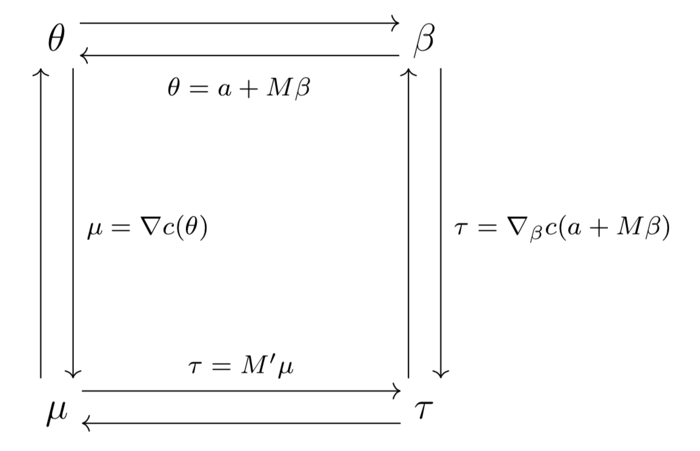

\allowdisplaybreaks

\newcommand{\Var}{\mathrm{Var}}
\newcommand{\Prob}{\mathbb{P}}
\newcommand{\R}{\mathbb{R}}
\newcommand{\inner}[1]{\langle #1 \rangle}

\newtheorem{defn}{Definition}
\newtheorem{thm}{Theorem}

\tableofcontents

```{r setup, include=FALSE}
knitr::opts_chunk$set(echo = TRUE)
```

<!-- \textwidth=31.9pc -->
<!-- \textheight=46.5pc -->
<!-- \oddsidemargin=1pc -->
<!-- \evensidemargin=1pc -->
<!-- \headsep=15pt -->
<!-- \topmargin=.6cm -->
<!-- \leftmargin=0.5cm -->
<!-- \rightmargin=0.5cm -->
<!-- \parindent=1.7pc -->
<!-- \parskip=0pt -->


A problem with discrete exponential family models is that some data configurations can put a wrench in the gears of parameter estimation and statistical inference. In particular, when the observed value of the canonical statistic is on the boundary of its support than the exponential family is not identifiable. In logistic regression, this problem is known as complete or quasi-complete separation and it is informally described as the setting in which there exists a hyperplane which perfectly separates the successes from the failures. More formally, we say that perfect data separation (complete separation) occurs when there exists a vector $b$ such that 
\begin{align*}
 b^Tx_i > 0 &\qquad\text{whenever} \; y_i = 1, \\
 b^Tx_i < 0 &\qquad\text{whenever} \; y_i = 0.
\end{align*}
See Section 6.5.1 in Agresti for more details.


# Agresti example

Let's look at the example in Section 6.5.1 in Agresti to describe complete separation and how to deal with it under the exponential family/maximum likelihood estimation paradigm (which isn't mentioned in Agresti). In this example, the separation is immediately evident

```{r}
x = (1:9 * 10)[-5]
y = c(0,0,0,0,1,1,1,1)
plot(x, y, pch = 19)
```

## Separating hyperplane

\vspace*{0.5cm}\noindent If we consider a simple logisitc regression model with an intercept and predictor term, then the vector $b = (-50, 1)$ satisfies the above conditions for complete separation

```{r}
## separation vector
b = c(-50, 1) 

## model matrix
M = cbind(1, x)

## check condition
cbind(M %*% b, y)
```

\vspace*{0.5cm}\noindent The data exhibits complete degeneracy, and statistical inference is essentially meaningless. Luckily the computational checks have warned the user that a potential problem has occurred. Note that these warning messages do not describe what the problem is or provide any guidance for how users should handle this problem. Moreover, these checks are purely computational and do not necessarily imply that separation has occurred. 

```{r}
m1 = glm(y ~ x, family = "binomial")

## summary table
summary(m1)

## LRT
anova(m1, test = "LRT")
```

## Optimization strangeness

\vspace*{0.5cm}\noindent Notice in the above that the number of Fisher scoring iterations is 25, which is the maximum allowable iterations under the default settings of the glm function. Look at what happens when change the defaults.

```{r}
m2 = glm(y ~ x, family = "binomial", 
          control = list(maxit = 1e4, epsilon = 1e-100))
summary(m2)
```

\vspace*{0.5cm}\noindent Changing the default optimization settings changed the summary output. In particular,  note that the submodel canonical parameter estimates and their corresponding standard errors are diverging when we allow for more iterations. Do not worry about this finding as a general phenomenon. We will not observe this phenomenon in well-behaved data configurations with properly conditioned model matrices, the Fisher scoring algorithm converges well before 25 iterations are observed. 

Returning to the model fit with the default settings, we see large canonical parameter estimates and mean value parameter estimates that are at the boundary of the closure of their parameter space $(0 < p < 1)$. Informally, estimates are "at infinity."

```{r}
## submodel canonical parameter estimates
betahat = m1$coefficients
betahat

## saturated model canonical parameter estimates
thetahat = as.numeric(M %*% betahat)
thetahat

## saturated model mean value parameter estimates
phat = predict(m1, type = "response")
phat
```

## Canonical statistic on the boundary of its support

Recall that the submodel can be written as 
$$
  \inner{y, M\beta} - c(M\beta) = \inner{M^Ty, \beta} - c_\beta(\beta)
$$

Also notice that the observed value of the canonical statistic $M^Ty$ for the above submodel is on the boundary of the support of values for $M^TY$. We will revisit this issue below.

\begin{center}
\includegraphics[width = 0.75\textwidth]{boundaryMtY.png}
\end{center}

Note that, by the observed equals expected property, $M^Ty$ is the MLE of the submodel mean-value parameter vector. The variance of the submodel canonical statistic is the Fisher information matrix.

<!-- ```{r, out.width = '50%', fig.align="center", echo = FALSE, fig.cap="A depiction of the transformations necessary to change between parameterizations. M is a known model matrix of full column rank, a is a known offset vector, and c is the cumulant function for the exponential family model." } -->
<!--  -->
<!-- ``` -->


## Asymptope of log likelihood


```{r, warning = FALSE, message = FALSE}
asymptote = t(sapply(1:30, function(iter){
  m1 = glm(y ~ x, family = "binomial", control = list(maxit = iter, epsilon = 1e-20))
  c(sqrt(log(crossprod(coef(m1)))), logLik(m1))
}))
asymptote = as.data.frame(asymptote)
```

\vspace*{0.5cm}

```{r, echo = FALSE, fig.align='center', fig.show='hold', out.width='.49\\linewidth', fig.width=3, fig.height=3}
library(ggplot2)
ggplot(asymptote) + 
  ggtitle('asymptote of the log likelihood') + 
  labs(x= expression(log(~"||"~beta~"||")), y= "log likelihood") + 
  geom_line(aes(x = V1, y = V2), color = "black") + 
  geom_abline(intercept = 0, slope = 0, lty = 2, color = "red") + 
  theme(legend.position="bottom", panel.background = element_blank(),
        legend.key = element_rect(fill = "white"),
        axis.ticks.x = element_blank(),
        panel.grid.major.x = element_line("lightgrey", size = 0.15), 
        panel.grid.major.y = element_line("lightgrey", size = 0.15), 
        panel.grid.minor.x = element_line("lightgrey", size = 0.07), 
        panel.grid.minor.y = element_line("lightgrey", size = 0.07))

ggplot(asymptote[25:30, ]) + 
  ggtitle('zoomed in') + 
  labs(x= expression(log(~"||"~beta~"||")), y = "") + 
  geom_line(aes(x = V1, y = V2), color = "black") + 
  geom_abline(intercept = 0, slope = 0, lty = 2, color = "red") + 
  theme(legend.position="bottom", panel.background = element_blank(),
        legend.key = element_rect(fill = "white"),
        axis.ticks.x = element_blank(),
        panel.grid.major.x = element_line("lightgrey", size = 0.15), 
        panel.grid.major.y = element_line("lightgrey", size = 0.15), 
        panel.grid.minor.x = element_line("lightgrey", size = 0.07), 
        panel.grid.minor.y = element_line("lightgrey", size = 0.07))
```


## Fisher information degeneracy

We now use R scripts to compute the Fisher information matrix. An eigenvector decomposition reveals that the Fisher information matrix is numerically singular. 

```{r}
invFI = vcov(m1)
FI = solve(invFI)
eigen(FI)
```

\vspace*{0.5cm}\noindent This implies that $\widehat{\Var}(M^TY) = 0$. Therefore, the MLE solution to this problem is that the observed data which are on the boundary are the only possible data that could have occurred. Of course, these are estimates and not actual parameters. The problem is how to make inferential statements about model parameters given this degeneracy.


# Inference in the complete separation setting

Before we discuss such an inferential approach we will give an example as motivation. The details of this example will be left for homework. Suppose that you have a coin that when flipped has a probability $0 < p < 1$ of landing heads, and that we know nothing about $p$. Suppose that you flip the coin four times and all four flips resulted in heads. Derive the MLE of $p$ and the MLE of $\Var(Y_1)$ under the standard Bernoulli model. Now, for some error tolerance $0 < \alpha < 1$, derive a valid one-sided confidence interval for $p$ making use of the statement $\Prob\left(\sum_{i=1}^4 Y_i = 4\right)$.


## Some theoretical details

### Preliminaries

We will consider a full exponential family with log likelihood
\begin{equation} \label{loglike}
  l(\theta) = \langle y, \theta \rangle - c(\theta).
\end{equation}
Let $C$ be the convex support of the canonical statistic, where we define the convex support as the smallest convex set that contains all values of the canonical statistic with probability equal to one. Define the tangent cone of $C$ at observed value of the canonical statistics $y$ as
$$
  T_C(y) = \text{cl}\{s(w -y): w \in C \; \text{and} \; s > 0\},
$$
where cl denotes the closure of a set.

A similar but simpler version of Theorem 4 from \cite{geyer2009likelihood} states that:
\begin{thm}
For a full exponential family with log likelihood \eqref{loglike}, convex support $C$ and observed value of the canonical statistic $y \in C$, the following are equivalent:
\begin{itemize}
\item[a)] The MLE exists.
\item[b)] The tangent cone $T_C(y)$ is a vector subspace.
\end{itemize}
\end{thm}


<!-- \begin{defn} -->
<!-- Suppose a full exponential family with canonical parameter space $\Theta$, convex support $C$, log likelihood defined as usual, then a vector $\delta$ is a *direction of constancy* if, for all $\theta \in \Theta$, -->
<!-- $$ -->
<!--   s \mapsto l(\theta + s\delta) -->
<!-- $$ -->
<!-- is constant. -->
<!-- \end{defn} -->

<!-- \begin{defn} -->
<!-- Suppose a full exponential family with canonical parameter space $\Theta$, convex support $C$, log likelihood defined as usual, then a vector $\delta$ is a *direction of recession* if, for all $\theta \in \Theta$, -->
<!-- $$ -->
<!--   s \mapsto l(\theta + s\delta) -->
<!-- $$ -->
<!-- is non-decreasing. -->
<!-- \end{defn} -->

Thus the MLE does not exist when the canonical statistic is on the boundary of its support. 

### Completion of exponential family

The MLE may exist in the completion of the exponential family when it does not exist (ie when the canonical statistic is on the boundary of its support). We now define the completion of the exponential family.

\begin{defn}
Let $\theta_n$, $n = 1,\ldots,$ be a sequence of canonical parameter vectors for an exponential family having log likelihood \eqref{loglike}. Let $h_n(y) = l(\theta_n)$, and suppose that $h_n(y) \to h(y)$ pointwise as $n \to \infty$ where limits $-\infty$ and $+\infty$ are allowed. The limiting functions $h$ form the completion of the exponential family.
\end{defn}

In the above definition $h_n$ is a sequence of affine functions, 
$$
  h_n(y) = l(\theta_n) = \langle y, \theta_n \rangle - c(\theta_n)
$$
and the limiting function $h$ is a "generalized affine function." Generalized affine functions and their properties are beyond the scope of this course. Definitions and details of generalized affine functions are presented in Section 6.1 of [Eck and Geyer (2021)](https://projecteuclid.org/journals/electronic-journal-of-statistics/volume-15/issue-1/Computationally-efficient-likelihood-inference-in-exponential-families-when-the-maximum/10.1214/21-EJS1815.full).


### Likelihood maximizing sequences

Now suppose that $\theta_n$ be a likelihood maximizing sequence of canonical parameter vectors (think of a Newton-Raphson algorithm where $n$ is the iteration number, and $\theta_n$ is the maximizer at iteration $n$), that is,
$$
l(\theta_n) \to \sup_{\theta \in \Theta} l(\theta), \qquad as \; n \to \infty, 
$$
where $\sup_{\theta\in\Theta} l(\theta) < \infty$. 

Define $h_n(y) = l(\theta_n)$ as in the definition about the completion of exponential families. The limiting density $e^h$ corresponds to the MLE distribution in the completion. Again, these objects are beyond the scope of this course. Further details can be found in [Eck and Geyer (2021)](https://projecteuclid.org/journals/electronic-journal-of-statistics/volume-15/issue-1/Computationally-efficient-likelihood-inference-in-exponential-families-when-the-maximum/10.1214/21-EJS1815.full).

### MLE exists in completion and Fisher Information degeneracy

Now suppose that the MLE does not exist in the traditional exist and it exists in the completion of the exponential family, and suppose that we know the convex support set of the MLE distribution in the completion. Call this support set $A$. 

Since the observed value of the canonical statistic is contained in $A$ with probability one, and the canonical statistic for a GLM is $M^TY$, then we have $A = M^Ty + V$ where $Y$ is the response vector, and $y$ its observed value, and $V$ is a vector space [Geyer (2009), Section 3.9](https://projecteuclid.org/journals/electronic-journal-of-statistics/volume-3/issue-none/Likelihood-inference-in-exponential-families-and-directions-of-recession/10.1214/08-EJS349.full).

Then the limiting exponential family model taken along the maximum likelihood sequence $\theta_n$ (referred to as a limiting conditional model, or LCM for short) in which the MLE in the completion is found is the original model (OM) conditioned on the event
$$
  M^T(Y - y) \in V,\qquad \text{almost surely}.
$$

Suppose that we can characterize $V$ as the subspace where a finite set of linear equalities are satisfied
$$
  V = \{ w \in \R^p : \inner{w,\eta_i} = 0, i=1,\ldots,j\}. 
$$
Then we have that the LCM is conditioned 
$$
  \inner{M^T(Y-y),\eta_i} = 0, \qquad i=1,\ldots,j.
$$
Recall that Fisher information is the variance for $M^TY$. From this we see that the vectors $\eta_1,\ldots,\eta_j$ span the null space of the Fisher information matrix for the LCM. The null space of the Fisher information matrix for the LCM is well approximated by the Fisher information matrix for the OM at parameter values that are close to maximizing the likelihood. 

We can write 
$$
  \inner{M^T(Y-y),\eta_i} = \inner{(Y-y),M\eta_i}.
$$
Thus, the LCM is the OM conditioned on the event
\begin{equation} \label{LCMevent}
  \inner{Y,M\eta_i} = \inner{y,M\eta_i}, \qquad \text{almost surely for} \; i \in 1,\ldots,j.
\end{equation}
The event \eqref{LCMevent} fixes some components of the response vector at their observed values and leaves the rest entirely unconstrained. Those components that are entirely unconstrained are those for which the corresponding component of $M\eta_i$ is zero (or, taking account of the inexactness of computer arithmetic, nearly zero) for all $i = 1,\ldots,j$. Such data points are said to form the LCM. Classical methods can be used to analyze the sample comprised of unconstrained data points which form the LCM.

In our motivating Agresti example we see that there no such points where $M\eta_i = 0$. 

```{r}
M %*% eigen(FI)$vec
```

Therefore all components of the response are fixed at their observed value in this example. This data is completely degenerate.


## One-sided confidence intervals

We now provide a method for calculating these one-sided confidence intervals. Let 

 - $I$ denote the index set of the components of the response vector on which we condition the OM to get the LCM. 
 - $Y_I$ and $y_I$ denote these components considered as a random vector and as an observed value, respectively. 
 - $\hat\beta$ is the estimated MLE of $\beta$ in the LCM. 
 - $\Gamma_\text{lim}$ is the null space of the Fisher information matrix.

Then endpoints for a $100(1 - \alpha)\%$ confidence interval for a scalar parameter $g(\beta)$ are
\begin{equation} \label{eq:g-optim}
   \min_{\substack{\gamma \in \Gamma_\text{lim} \\
   \Prob_{\hat{\beta} + \gamma}(Y_I = y_I) \ge \alpha}}
   g(\hat{\beta} + \gamma)
   \qquad \text{and} \qquad
   \max_{\substack{\gamma \in \Gamma_\text{lim} \\
   \Prob_{\hat{\beta} + \gamma}(Y_I = y_I) \ge \alpha}}
   g(\hat{\beta} + \gamma).
\end{equation}
In our Agresti example, $\hat\beta$ is 0 and $\Gamma_\text{lim} = \R^2$. Note that at least one of \eqref{eq:g-optim} is at the end of the range of this parameter (otherwise we can use conventional two-sided intervals).

The $100(1 - \alpha)\%$ one-sided confidence intervals \eqref{eq:g-optim} follow from the same intuition of the "4 heads in 4 coin tosses" motivating example.


### Logistic and binomial regression specifics

For logistic and binomial regression, let $p = \text{logit}^{-1}(\theta)$ denote the mean value parameter vector (here $\text{logit}^{-1}$ operates componentwise). Then, 
$$
   \Prob_\beta(Y_I = y_I)
   =
   \prod_{i \in I} p_i^{y_i} (1 - p_i)^{n_i - y_i}
$$
where the $n_i$ are the binomial sample sizes.  In logistic regression we have $n_i = 1$ for all $i$, but in binomial regression we have $n_i \geq 1$ for all $i$. We could take the confidence interval problem to be
\begin{equation} \label{eq:logistic}
\begin{split}
  &\text{maximize} \quad p_k,
    \qquad
   \text{subject to} 
     \quad \prod_{i \in I} p_i^{y_i} (1 - p_i)^{n_i - y_i} \ge \alpha; \\
  &\text{minimize} \quad p_k,
    \qquad
   \text{subject to} 
     \quad \prod_{i \in I} p_i^{y_i} (1 - p_i)^{n_i - y_i} \ge \alpha     
\end{split}     
\end{equation}
where $p$ is taken to be the function of $\gamma$ described above. And this can be done for any $k \in I$. However, the problem will be more computationally stable if we state it as 
\begin{equation} \label{eq:logistic-2}
\begin{split}
   \text{maximize} & \quad \theta_k
   \\
   \text{subject to} & \quad
   \sum_{i \in I} \bigl[ y_i \log(p_i) + (n_i - y_i) \log(1 - p_i) \bigr]
   \ge \log(\alpha); 
   \\
   \text{minimize} & \quad \theta_k
   \\
   \text{subject to} & \quad
   \sum_{i \in I} \bigl[ y_i \log(p_i) + (n_i - y_i) \log(1 - p_i) \bigr]
   \ge \log(\alpha),
\end{split}
\end{equation}
where $\theta_i = \text{logit}(p_i)$ is a monotone transformation and $\log$ is a monotone transformation. The two problems \eqref{eq:logistic} and \eqref{eq:logistic-2} are equivalent. 

We maximize canonical rather than mean value parameters to avoid extreme inexactness of computer arithmetic in calculating mean value parameters near zero and one. We take logs in the constraint for the same reasons we take logs of likelihoods.


### Poisson regression specifics

For Poisson sampling, let $\mu = \exp(\theta)$ denote the mean value parameter (here $\exp$ operates componentwise like the R function of the same name does), then
$$
   \Prob_\beta(Y_I = y_I) = \exp\left( - \sum_{i \in I} \mu_i \right).
$$
We take the confidence interval problem to be
\begin{equation} \label{eq:poisson-ci-problem}
   \text{maximize} 
     \quad \mu_k,
   \qquad
   \text{subject to}
     \quad - \sum_{i \in I} \mu_i \ge \log(\alpha)
\end{equation}
where $\mu$ is taken to be the function of $\gamma$ described in \eqref{eq:g-optim}.  The optimization in \eqref{eq:poisson-ci-problem} can be done for any $k \in I$.  


## Return to Agresti example

The exponential family in this Agresti example is completely degenerate. The MLE does not exist in the traditional sense, but does exist in the completion of the exponential family (maximized log likelihood is bounded). Conventional maximum likelihood computations come close, in a sense, to finding the MLE in the completion of the exponential family. They go uphill on the likelihood function until they meet their convergence criteria and stop. 

At this point, canonical parameter estimates $\hat\theta$ and $\hat\beta$ are still infinitely far away from the MLE in the completion, but mean value parameter estimates $\hat\mu$ are close to the MLE in the completion, and the corresponding probability distributions are close in total variation norm to the MLE probability distribution in the completion.


### Software to perform inference

The \texttt{inference} function in the R package \texttt{glmdr} (see the \texttt{glmdr} directory in the stat528resources repo; you will have to install the package locally) determines one-sided confidence intervals for mean value parameters corresponding to response values $y_I$ for logistic and binomial regression as in \eqref{eq:logistic-2} and Poisson regression as in \eqref{eq:poisson-ci-problem}.

```{r, message = FALSE}
library(glmdr)
```

We return to the motivating Agresti example. Here we see that the Fisher information matrix has only null eigenvectors. 
```{r}
eigen(FI)
```

\vspace*{0.5cm}\noindent In this case the MLE of the saturated model mean value parameters agree with the observed data; they are on the boundary of the set of possible values, either zero or one. Thus the LCM is completely degenerate at the one point set containing only the observed value of the canonical statistic of this exponential family. One-sided confidence intervals for mean value parameters (success probability considered as a function of the predictor $x$) are now computed. We first the logistic regression model using the \texttt{glmdr} fitting function instead of \texttt{glm}.
```{r, cache = TRUE}
m_glmdr = glmdr(y ~ x)

## summary information
summary(m_glmdr)
```

We then use the \texttt{inference} function to obtain one-sided confidence intervals for mean-value parameters corresponding to components $Y_I$ that are constrained to be their observed values. This function performs the optimization in \eqref{eq:g-optim} where the function $g$ in \eqref{eq:g-optim} is taken to be the map from submodel canonical parameter to saturated model mean-value parameters (ie the conditional success probabilities).

```{r, cache = TRUE}
## one-sided CIs
CIs = inference(m_glmdr)
CIs
```

We now plot these one-sided confidence intervals.

```{r fig.height = 5, fig.width = 6, fig.align = "center"}
bounds.lower.p = CIs$lower
bounds.upper.p = CIs$upper
par(mar = c(4, 4, 0, 0) + 0.1)
plot(x, y, axes = FALSE, type = "n",
    xlab = expression(x), ylab = expression(mu(x)))
segments(x, bounds.lower.p, x, bounds.upper.p, lwd = 2)
box()
axis(side = 1)
axis(side = 2)
points(x, y, pch = 21, bg = "white")
```

\vspace*{0.5cm}\noindent These confidence intervals are quite wide. This is due to the relatively lack of data.


## Commentary on Agresti

The $n = 8$ data point example that we analyzed comes from Section 6.5.1 in Agresti. However, this textbook provides no model based inferential solution to this problem. In the above, we provided such a solution that exists within the exponential family modeling and maximum likelihood estimation paradigms. To be fair to Agresti, "solutions" to complete separation are discussed in Sections 7.4.7 and 7.4.8. This approach circumvents the model-based approach. 


# Not completely degenerate

In the Agresti example we noticed that the estimated Fisher information matrix was completely degenerate. This need not be so in generality, the Fisher information matrix can exhibit partial degeneracy. When this is so the LCM is not trivially degenerate like in the Agresti example. Data pairs $(y_i,x_i)$ corresponding to response vectors which are left unconstrained form the LCM and parameter estimation can be conducted in a traditional manner. We will explore an example where with partial degeneracy. 

We will consider the endometrial example in which the a histology grade and risk factors for 79 cases of endometrial cancer are analyzed. 

```{r, message = FALSE, warning = FALSE}
library(enrichwith)
data(endometrial)
head(endometrial)
```

We begin with a standard logistic regression fit.


```{r}
m = glm(HG ~ ., data = endometrial, family = "binomial", 
         x = TRUE, y = TRUE)
summary(m)
```

We observe **quasi-complete separation** in NV (a categorical variable with two levels), where we note that a 2 × 2 contingency table with an empty (zero) cell is an example of quasi-complete separation. 

```{r}
b = c(0,1,0,0)
library(data.table)
foo = setDT(as.data.frame(cbind(m$y, m$x %*% b)))
colnames(foo) = c("y", "NV")
foo[, .(.N), by = c("y", "NV")]
```

We now use \texttt{glmdr} to do our fitting.

```{r}
m_glmdr = glmdr(HG ~ ., data = endometrial, family = "binomial")
summary(m_glmdr)
```

We now obtain inference for all mean-value parameters in two steps. We first use traditional methods to obtain inferences for mean-value parameters that are unconstrained. Then we can use the \texttt{inference} function to obtain one-sided confidence intervals for components of the response vector that are constrained at their observed values.

```{r}
m2 = update(m, subset = m_glmdr$linearity)
summary(m2)

## get estimates of mean-value parameters in the LCM
preds = predict(m2, se.fit = TRUE, type = "response")
head(cbind(preds$fit, preds$se.fit))

## get one-sided CIs for constrained responses
preds_constrained = inference(m_glmdr)
cbind(endometrial[!m_glmdr$linearity, ], preds_constrained)
```


We can test for the significance of the \texttt{NV} variable in the presence of quasi-complete separation using traditional means. Methods get harder when the degeneracy exists in the null model as explained in Section 3.15 of Geyer (2009).


```{r}
m_small = glm(HG ~ PI + EH, data = endometrial, family = "binomial", 
         x = TRUE, y = TRUE)
anova(m_small, m, test = "LRT")
AIC(m); AIC(m_small)
```


## Other approaches: the problem with priors

We now demonstrate inferential inconsistencies between the Bayesian methods, namely the inconsistencies with the weakly informative prior advocated [here](https://projecteuclid.org/journals/annals-of-applied-statistics/volume-2/issue-4/A-weakly-informative-default-prior-distribution-for-logistic-and-other/10.1214/08-AOAS191.full) and implemented in the \texttt{bayesglm} package and Jeffrey's prior based approaches advocated for by [Ioannis Kosmidis](https://www.ikosmidis.com/) and [David Firth](https://warwick.ac.uk/fac/sci/statistics/staff/academic-research/firth/) in several papers and implemented in the \texttt{brglm2} package.

We first show that the \texttt{bayesglm} defaults produce p-values for the \texttt{NV} variable that are close to 0.05. Modest changes to these defaults can change decisions about this variable's significance when testing at the 0.05 level.

```{r, message=FALSE, warning = FALSE}
library(arm) # for bayesglm
library(brglm2) # for brglm2
#bayesglm
bayes_mod1 = bayesglm(HG~.,data=endometrial,family="binomial",
                       prior.scale = 1)
bayes_mod = bayesglm(HG~.,data=endometrial,family="binomial")
bayes_mod5 = bayesglm(HG~.,data=endometrial,family="binomial",
                       prior.scale = 5)
bayes_mod10 = bayesglm(HG~.,data=endometrial,family="binomial",
                       prior.scale = 10)

c(summary(bayes_mod1)$coef[2,4], 
  summary(bayes_mod)$coef[2,4],
  summary(bayes_mod5)$coef[2,4],
  summary(bayes_mod10)$coef[2,4])
```

```{r plot, cache = TRUE}
xx = seq(from = 1, to = 5, length = 1e3)
foo = unlist(lapply(xx, function(j){
  summary(bayesglm(HG~.,data=endometrial,family="binomial",
                   prior.scale = j))$coef[2,4]
}))

plot.new()
plot.window(xlim = c(1,5), ylim = c(0.025, 0.0725))
title("Neovasculization p-value vs prior scale")
lines(xx, foo)
axis(1)
axis(2)
abline(h = 0.05, col = "red", lty = 2)
abline(v = 2.5, col = "blue", lty = 1)
mtext("prior scale", side = 1, line = 2.5)
mtext("p-value", side = 2, line = 2.5)
```

Different \texttt{brglm} fitting options yield different results, although these differences do not materialize in different conclusions for the \texttt{NV} variable when testing at the 0.05 significance level. However, these results conflict those produced by the \texttt{bayesglm} package.


```{r}
#brglm2
brglm_mod = glm(HG~.,data=endometrial,family = "binomial",
                 method = "brglm_fit", type = "MPL_Jeffreys")
brglm_mod_AS_mean = glm(HG~.,data=endometrial,family = "binomial",
                 method = "brglm_fit", type = "AS_mean")
brglm_mod_AS_median = glm(HG~.,data=endometrial,family = "binomial",
                         method = "brglm_fit", type = "AS_median")
brglm_mod_AS_mixed = glm(HG~.,data=endometrial,family = "binomial",
                           method = "brglm_fit", type = "AS_mixed")
#brglm_mod_AS_correction = glm(HG~.,data=endometrial,family = "binomial",
#                           method = "brglm_fit", type = "correction")
summary(brglm_mod)$coef[2,4]
summary(brglm_mod_AS_mean)$coef[2,4]
summary(brglm_mod_AS_median)$coef[2,4]
summary(brglm_mod_AS_mixed)$coef[2,4]
```

So which prior do we use?


# Acknowledgments

\noindent These notes borrow materials from Charles Geyer's notes on exponential families. We also borrow materials from \cite{agresti2013cat}, \cite{geyer2009likelihood}, and \cite{eck2021computationally}. Special thanks to Suyoung Park for his work on the \texttt{glmdr} package.


\bibliographystyle{plainnat}
\bibliography{../note_sources}

